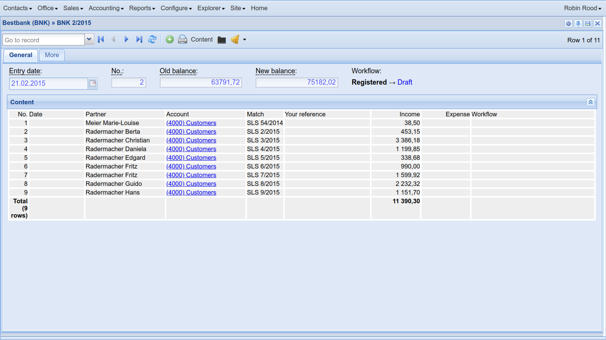
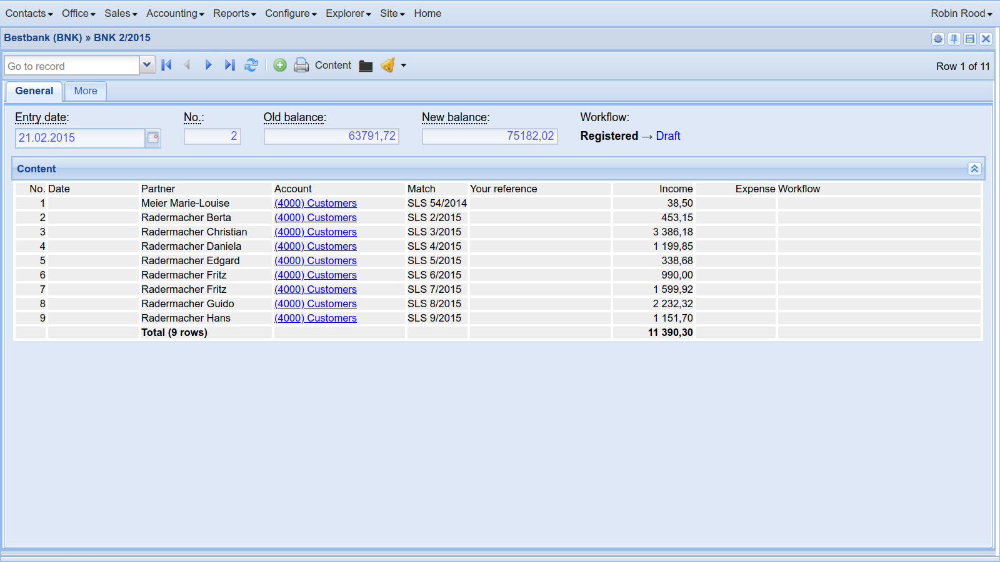

.. doctest docs/dev/actors.rst
.. _dev.actors:

======================
Introduction to actors
======================

*Tables* and *choicelists* have certain things in common.  When we
refer to them in general, then we call them **actors**.

An alternative name for "Actor" might have been "Resource" or "View",
but these words are already being used very often, so in Lino we
called them *actors*.

An **actor** is a globally known unique object that offers *actions*.
Almost every incoming web request in a Lino application requests
execution of a given *action* on a given *actor*.

The most common type of actors are *tables*.  But not all actors are
tables.  Another type of actors are *frames* which display some data
in some other form.  One such frame actor is the calendar panel,
another one is :class:`lino.utils.report.EmptyTable`, used to display
reports.

.. contents::
   :depth: 1
   :local:

.. include:: /../docs/shared/include/tested.rst

The code snippets on this page use the :mod:`lino_book.projects.team` demo
project.

>>> from lino import startup
>>> startup('lino_book.projects.team.settings.doctests')
>>> from lino.api.doctest import *

Identifying actors
==================

Actors are identified by their `app_label.ClassName`, similar to
Django's models.

When we say that actors are "globally known unique objects", then we
refer to  :data:`rt.models`

Actors are never instantiated, we use only the class objects.  This
leads to more natural application code.  For example you can either
import them or use :data:`rt.models`.

>>> from lino_xl.lib.working.ui import WorkedHours
>>> rt.models.working.WorkedHours is WorkedHours
True

>>> str(WorkedHours)
'working.WorkedHours'

>>> repr(WorkedHours)
'lino_xl.lib.working.ui.WorkedHours'

Getting a list of all actors
============================

When Lino starts up, it automatically discovers the installed plugins
and registers each subclass of :class:`Actor` as an actor.

>>> len(actors.actors_list)
258

The actors aren't collected only in this global list but also at different
places depending on their type.

Database tables are subdivided into "master tables", "slave tables"
and "generic slave tables":

>>> from lino.core import kernel
>>> len(kernel.master_tables)
121
>>> kernel.master_tables[0]
lino.modlib.system.models.SiteConfigs

>>> len(kernel.slave_tables)
54
>>> kernel.slave_tables[0]
lino_xl.lib.countries.models.PlacesByPlace

>>> list(sorted(kernel.generic_slaves.values(), key=str))
[lino_xl.lib.cal.ui.EntriesByController, lino_xl.lib.cal.ui.TasksByController, lino.modlib.changes.models.ChangesByMaster, lino.modlib.changes.models.ChangesByObject, lino.modlib.checkdata.models.ProblemsByOwner, lino.modlib.comments.ui.CommentsByRFC, lino.modlib.comments.ui.MentionsByOwner, lino_xl.lib.excerpts.models.ExcerptsByOwner, lino.modlib.gfks.models.HelpTextsByModel, lino.modlib.uploads.models.UploadsByController]

>>> for a in kernel.generic_slaves.values():
...    assert a not in kernel.slave_tables
...    assert a in actors.actors_list

Another category are virtual tables

>>> kernel.virtual_tables  #doctest: +NORMALIZE_WHITESPACE
[lino.modlib.about.models.SiteSearch, lino.modlib.gfks.models.BrokenGFKs,
lino.modlib.gfks.models.BrokenGFKsByModel, lino_xl.lib.calview.ui.MonthlyPlanner,
lino_xl.lib.calview.ui.DailyView, lino_xl.lib.calview.ui.WeeklyView,
lino_xl.lib.calview.ui.MonthlyView, lino_xl.lib.working.ui.WorkedHours,
lino.modlib.users.desktop.UserRoles]

Another category are choicelists

>>> len(kernel.CHOICELISTS)
37
>>> list(sorted(kernel.CHOICELISTS.items()))[6]
('cal.GuestStates', lino_xl.lib.cal.choicelists.GuestStates)

>>> for a in kernel.CHOICELISTS.values():
...    if a not in actors.actors_list:
...        print(a)

And a last category are what we call "frames":

>>> kernel.frames_list
[lino.modlib.about.models.About]

To instantiate or not to instantiate?
=====================================

While this design choice of never instantiating actors has advantages,
it also has some disadvantages:

- Every method of an actor must have a `@classmethod` decorator.
  That's a bit surprising for newbies.

- Concepts like :class:`lino.core.utils.Parametrizable` are common to
  actions and actors, but need a "class method" and an "instance
  method" version of their logic.

Here is an example:

.. literalinclude:: actors1.py

The output will be::

    This is <class '__main__.MyJournals'> with parameters = {'foo': 1, 'bar': 2}
    This is <class '__main__.Action'> with parameters = None

We might decide one day that Lino creates an automatic singleton
instance for each Actor at startup.

.. _dev.actors.sums:

Showing, hiding and formatting sums
===================================

.. currentmodule:: lino.core.actors

Lino automatically assumes that you want a sum for every numeric field.
Sometimes this is now waht you want.  In that case you can say::

    MyModel.set_widget_option('year", show_sum=False)

When a table has at least one column with a sum, Lino adds a "totals" line when
printing the table.  The first empty column in that line will receive a text
"Total (9 rows)".  That text is customizable by overriding
:meth:`Actor.get_sum_text`.

If you don't want that text to appear in the first empty column, you can
specify a value for :attr:`Actor.sum_text_column`.  Usage example:  the first
screenshot below is without :attr:`sum_text_column`, the second is with
:attr:`sum_text_column` set to 2:

