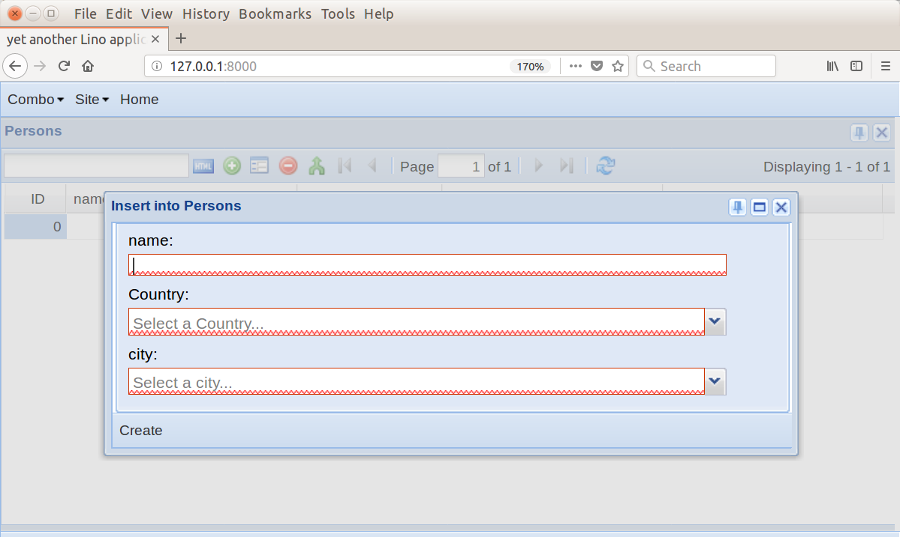
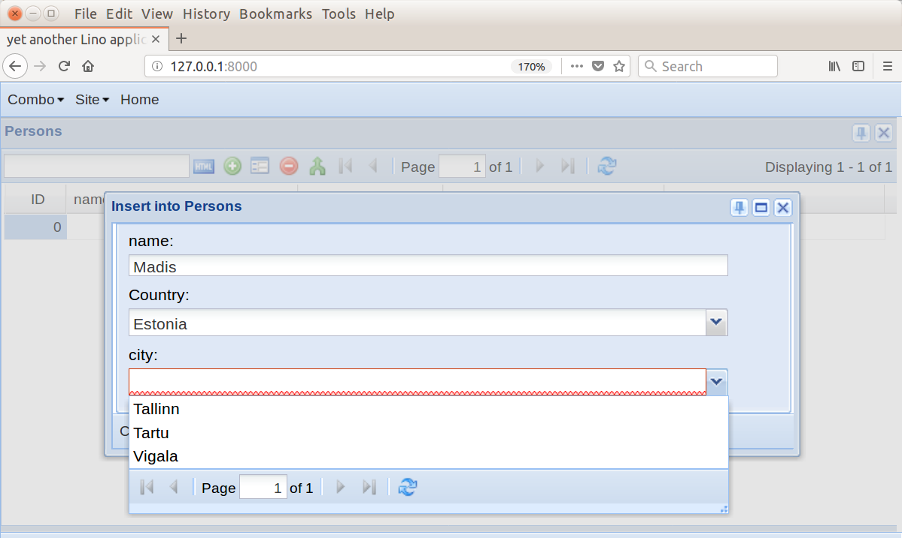
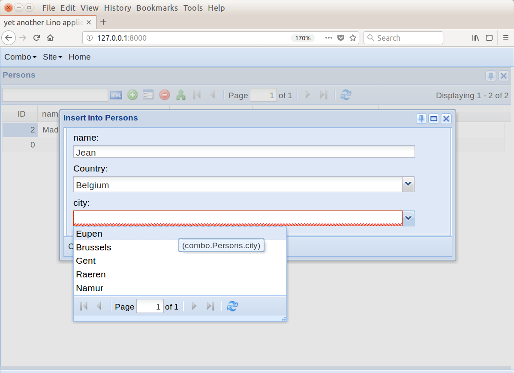

.. doctest docs/dev/combo/index.rst
.. _lino.dev.combo:

============================================
Introduction to choosers
============================================

This unit uses the :mod:`lino_book.projects.combo` project to show how
to define dynamic lists of choices for a combobox field in a Lino
application.

.. contents::
    :depth: 1
    :local:

Context-sensitive comboboxes
============================

The challenge is old: when you have two fields on a model (here
`country` and `city` on the `Person` model) and you want the choices
for one of these field (here `city`) to depend on the value of the
other field (here `country`), then you need a hack because Django has
no built-in API for producing this behaviour.

The Lino solution is simpler to use than Freitas' solution because we
did the AJAX magics once for all behind the scenes. In Lino you simply
define the following function on the `Person` model::

    @dd.chooser()
    def city_choices(cls, country):
        return rt.models.combo.City.objects.filter(country=country)

Lino finds this method when analysing the models at startup because it
is marked with the :func:`dd.chooser <lino.utils.chooser>` decorator
(which turns it into a "chooser" object) and has a name of the form
``<fieldname>_choices``.  Lino then analyses the signature of that
chooser: every named positional argument must match another field of
the model.  And Lino then does the dirty work of generating
appropriate JavaScript and HTML code and the views which respond to
the AJAX calls.

.. _learning_combos:

Learning Comboboxes
-------------------

When the model also defines a method `create_FOO_choice`, then the
chooser will become "learning": the ComboBox will be told to accept
also new values, and the server will handle these cases accordingly.

In the example application you can create new cities by simply typing
them into the combobox.

Database models
===============

Here is the :xfile:`models.py` file :

.. literalinclude:: ../../../lino_book/projects/combo/models.py

These models are taken from Vitor Freitas' blog post `How to Implement
Dependent/Chained Dropdown List with Django
<https://simpleisbetterthancomplex.com/tutorial/2018/01/29/how-to-implement-dependent-or-chained-dropdown-list-with-django.html>`__.

Screenshots
===========

           

           

Other files
===========

Here are the other files used in this unit.

The :xfile:`desktop.py` file specifies a table for every model:

.. literalinclude:: ../../../lino_book/projects/combo/desktop.py

The :xfile:`__init__.py` file specifies how the tables are organized
in the main menu:

.. literalinclude:: ../../../lino_book/projects/combo/__init__.py

Here is the project's :xfile:`settings.py` file :

.. literalinclude:: ../../../lino_book/projects/combo/settings.py

And finally the :file:`fixtures/demo.py` file contains the data we use
to fill our database:

.. literalinclude:: ../../../lino_book/projects/combo/fixtures/demo.py

Exercise
========

The files we are going to use in this tutorial are already on your
hard disk in the :mod:`lino_book.projects.combo` package.

Start your development server and your browser, and have a look at the
application::

  $ go combo
  $ python manage.py runserver

Explore the application and try to extend it: change things in the
code and see what happens.

Doctests
========

The remaining samples are here in order to test the project.
  
>>> from lino import startup
>>> startup('lino_book.projects.combo.settings')
>>> from lino.api.doctest import *
    
>>> rt.show('combo.Cities')
==== ========= ==========
 ID   Country   name
---- --------- ----------
 1    Belgium   Eupen
 2    Belgium   Brussels
 3    Belgium   Gent
 4    Belgium   Raeren
 5    Belgium   Namur
 6    Estonia   Tallinn
 7    Estonia   Tartu
 8    Estonia   Vigala
==== ========= ==========
<BLANKLINE>

