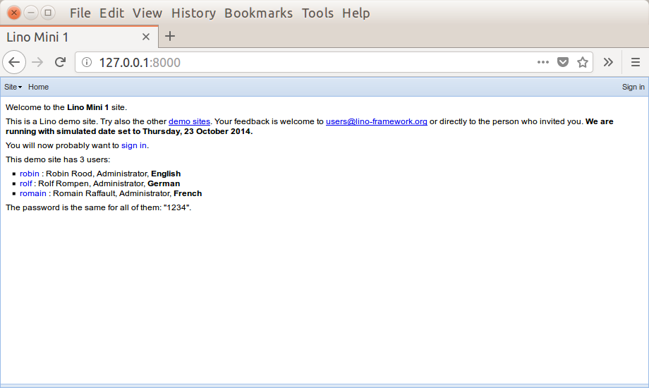

.. _user.install:
.. _getlino.install.dev:
.. _lino.dev.install:
.. _dev.install:

=========================================
Installing a Lino developer environment
=========================================

.. _invoke: http://www.pyinvoke.org/
.. _atelier: http://atelier.lino-framework.org/
.. _pycrypto: https://pypi.python.org/pypi/pycrypto
.. _Debian: http://www.debian.org/

.. highlight:: console

This document describes how to install a Lino :term:`developer environment` on
your computer.  This is the easiest way to get started. You should read this
document also if you plan to later evolve into a *contributing* developer as
described in :doc:`/team/install/index`.

This document is written for Debian_ and derived distributions. Other Linuxes
should be pretty similar.

This document assumes you are familiar with the Linux shell at least for basic
file operations like :cmd:`ls`, :cmd:`cp`, :cmd:`mkdir`, :cmd:`rmdir`, file
permissions, environment variables, bash scripts etc.  Otherwise we suggest to
learn about :ref:`Working in a UNIX shell <learning.unix>`.

.. contents::
    :depth: 1
    :local:

.. _lino.dev.env:

Set up a virtual Python environment
===================================

Rather than installing Lino into your site-wide Python installation, you install
it to a separate virtual Python environment, also known as a :term:`virtualenv`

If virtualenvs are new to you: the reason for creating a new environment is to
separate Lino from your system-wide Python. The main advantages are: if you are
also developing other things with Python you might require different packages
than what Lino uses, and there is the chance of version or dependency conflicts.

Also if you wish to remove Lino from your system you only need to remove the
virtual environment rather than trying to remove Lino's dependencies from the
system environment without breaking any other programs that use python.

Before using virtualenvs, we must install the feature::

  $ sudo apt-get install python3-venv

In a :term:`developer environment` we suggest :file:`~/lino/env` as your
*default environment*. So here we go::

  $ python3 -m venv ~/lino/env
  $ source ~/lino/env/bin/activate

The dot (``.``) is a synonym for the :cmd:`source` command. If you
didn't know it, read the `manpage
<http://ss64.com/bash/source.html>`__ and `What does 'source' do?
<http://superuser.com/questions/46139/what-does-source-do>`__

After creating a new environment, you should always update `pip` and
`setuptools` to the latest version::

  $ pip install -U pip setuptools
  Collecting pip
    Using cached https://files.pythonhosted.org/packages/43/84/23ed6a1796480a6f1a2d38f2802901d078266bda38388954d01d3f2e821d/pip-20.1.1-py2.py3-none-any.whl
  Collecting setuptools
    Downloading https://files.pythonhosted.org/packages/8e/11/9e10f1cad4518cb307b484c255cae61e97f05b82f6d536932b1714e01b47/setuptools-49.2.0-py3-none-any.whl (789kB)
      100% |████████████████████████████████| 798kB 1.1MB/s
  Installing collected packages: pip, setuptools
    ...
  Successfully installed pip-20.1.1 setuptools-49.2.0

.. rubric:: Did you know?

You can **deactivate** a virtual environment with the command
:cmd:`deactivate`.  This switches you back to your machine's
system-wide environment.

You can **switch to another** virtualenv simply by activating it, you
don't need to deactivate the current one first.

You should never **rename** a virtualenv (they are not designed for
that), but you can easily create a new one and remove the old one.

To learn more, read Dan Poirier's post `Managing multiple Python
projects: Virtual environments
<https://www.caktusgroup.com/blog/2016/11/03/managing-multiple-python-projects-virtual-environments/>`__
where he explains what they are and why you want them.

.. _dev.default_venv:

Set your default virtualenv
===========================

As a developer you probably don't want to type ``source
~/lino/env/bin/activate`` each time you open a new terminal with
:kbd:`Ctrl+Alt+T`.  So you should set your :term:`default environment`  by
adding the following line to your :file:`~/.bashrc` file::

  source ~/lino/env/bin/activate

You will also instruct your favourite :doc:`code editor </dev/newbies/editor>`
to use this default environment when doing syntax checks or finding definitions
etc.  For example in :ref:`atom` you say :menuselection:`Edit --> Preferences
--> Packages` select the settings of the python-tools plugin and set the
:guilabel:`Path to Python directory` field to  :file:`~/lino/env/bin`

Run getlino
===========

Make sure your default environment is activated and then install :ref:`getlino`
via pip::

  $ pip install getlino

Note: In case you have used getlino on your machine before (maybe another
virtualenv, but the same machine), then you might want to delete your
configuration file before going on::

  rm ~/.getlino.conf

Then run :cmd:`getlino configure`::

  $ getlino configure --no-devtools

It asks a lot of questions, but you can hit :kbd:`ENTER` for each of them.

Warning : when getlino does not react to :kbd:`ENTER` but asks a ``[y or n]``
question, then you should read it and understand it before you hit :kbd:`y`.
getlino overwrites certain configuration files without making a backup copy.
Read twice before you hit :kbd:`y`!

For details about each question or if something doesn't work as expected, see
the documentation about :ref:`getlino`.

Your first Lino site
====================

Run :cmd:`getlino startsite` to create a first site::

  $ getlino startsite noi first

Run :manage:`runserver`::

  $ cd ~/lino/lino_local/first
  $ python manage.py runserver

Now start your browser, point it to http://127.0.0.1:8000/ and you
should see something like this:

Congratulations! Enjoy the first Lino application running on your
machine!

.. This process takes some time. Yes, we have a whole little collection of
  repositories and applications!  You don't need to dive into each of them right
  now, but you must at least *install* them so that your environment is complete.
  They are part of the Lino SDK because we also use them for running test suites.
  They are part of the Lino book because it would be difficult to explain Lino
  without having some serious examples. As a Lino developer you will sooner or
  later get in touch with these. See :doc:`overview` if you are curious.

Troubleshooting
===============

Using virtual environments seems to be one of the biggest challenges
for newbies. Here are some diagnostic tricks.

How to see which is your current virtualenv::

    $ echo $VIRTUAL_ENV
    /home/joe/lino/env

    $ which python
    /home/joe/lino/env/bin/python

How to see what's installed in your current virtualenv::

    $ pip freeze

The output will be about 60 lines of text, here is an excerpt::

    alabaster==0.7.9
    appy==0.9.4
    argh==0.26.2
    ...
    Django==1.11.2
    ...
    future==0.15.2
    ...
    -e git+git+ssh://git@github.com/lino-framework/lino.git@91c28245c970210474e2cc29ab2223fa4cf49c4d#egg=lino
    -e git+git+ssh://git@github.com/lino-framework/book.git@e1ce69aaa712956cf462498aa768d2a0c93ba5ec#egg=lino_book
    -e git+git+ssh://git@github.com/lino-framework/noi.git@2e56f2d07a940a42e563cfb8db4fa7444d073e7b#egg=lino_noi
    -e git+git@github.com:lino-framework/xl.git@db3875a6f7d449490537d68b08daf471a7f0e573#egg=lino_xl
    lxml==3.6.4
    ...
    Unipath==1.1
    WeasyPrint==0.31
    webencodings==0.5

Behind the scenes
=================

The getlino script does a lot of work.

These commands take some time when you run them the first time on your machine
because they will download and install all Python packages needed by Lino.  If
you install them a second time into another environment, the process will be
quicker because the dependencies have been cached.

Note that the `-e
<https://pip.pypa.io/en/latest/reference/pip_install.html#cmdoption-e>`_
command-line switch for :command:`pip` causes it to use the "development" mode.
Development mode means that these modules run "directly from source".  `pip`
does not *copy* the sources to your Python `site_packages`, but instead adds a
link to them.  The first argument after ``-e`` is not a *project name* but a
*directory*.

A quick test when you want to see whether Lino is installed is to say
"hello" to Lino:

.. py2rst::

   self.shell_block(["python", "-m", "lino.hello"])

In case you didn't know: Python's `-m
<https://docs.python.org/2/using/cmdline.html#cmdoption-m>`_
command-line switch instructs it to just *import* the specified module
(here :mod:`lino.hello`) and then to return to the command line.

Concepts
========

.. glossary::

  virtualenv

    A virtual Python environment.

  default environment

    The default :term:`virtualenv` you use when developing.
    See :ref:`dev.default_venv`

  developer environment

    A set of tools configured on the desktop computer of a Lino developer who
    wants to develop their own :term:`Lino application`.

  contributor environment

    An extended :term:`developer environment` suitable for developers who plan
    to potentially contribute to the :term:`Lino framework`.  A bit more work to
    install, but more future-proof.
