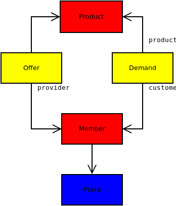

.. _dev.lets.step1:

=============================
Lino LETS (step 1)
=============================

.. contents::
   :local:

Overview
========

The fictive application we are going to write is a website of a Local
Exchange Trade System group (`LETS
<http://en.wikipedia.org/wiki/Local_exchange_trading_system>`_). The
members of that site would register the products and services they
want to sell or to buy. The goal is to connect the providers and the
customers.

.. _data_model_diagram:

Database structure
==================

- **Products** : one row for every product or service. We keep it
  simple and just record the designation for our products. We don't
  even record a price.

- **Members** : the people who use this site to register their offers
  and demands. For each member we record their contact data such as
  place and email.

- An **Offer** is when a given member declares that they want to *sell*
  a given product.

- A **Demand** is when a given member declares that they want to *buy* a
  given product.

- Every member is located in a given **Place**. And in a future
  version we want to add filtering on offers and demands limited to
  the place.

Here is a **graphical representation** of the database structure:

.. graphviz::

   digraph foo  {

       graph [renderer="neato"]

       node [shape=box]
       node [style=filled]
           node [fontname="times bold", fillcolor=red]
              Product Member
           node [fontname="times" fillcolor=gold]  Offer  Demand
           node [fontname="times italic" fillcolor=lightblue]  Place

       Product -> Offer[arrowhead="inv"]
       Product -> Demand[arrowhead="inv"]

       Offer -> Member[taillabel="provider", labelangle="-90", labeldistance="2"];
       Demand -> Member[taillabel="customer", labelangle="90", labeldistance="2"];
       Member ->  Place;

  }

You shoud do such diagrams interactively, together with the customer.
Above picture has been realized using `graphviz
<http://www.sphinx-doc.org/en/stable/ext/graphviz.html>`__.  You might
prefer `Dia <http://dia-installer.de/>`_ which renders it as follows:

There are many methodologies for visualizing a database model (`UML
<https://en.wikipedia.org/wiki/Unified_Modeling_Language>`_, `IDEF1X
<https://en.wikipedia.org/wiki/IDEF1X>`__), and above style is just
our favourite because it is so simple, intuitive and useful.  The
basic rules are:

- Every **node** on the diagram represents a database model.
- Every **arrow** on the diagram represents a `ForeignKey`.  We prefer
  to use the word **pointer** instead of *ForeignKey* when talking with
  a customer because that's more intuitive.

- We display the **name of a pointer** only if it differs from the
  model it points to. For example the arrow from *Offer* to *Product*
  is a FK field called `product`, defined on the *Offer* model. We do
  not display the name `product` on our diagram because that would be
  a waste of place.

The colors of this diagram are a convention for grouping the models
into three "data categories":

- **red** is for **master data** (i.e. relatively stable data)
- **yellow** is for **moving data** (i.e. data which changes
  relatively often)
- **blue** is for **configuration data** (i.e. data which is rather in
  background and accessible only to site administrators)

Menu structure
==============

The **main menu** is another thing that you should discuss with your customer
before even starting to write code. Let's imagine that our customer agrees with
the following menu structure. (Again: we just *imagine* here. It's obvious that
reality might be more complex.)

- **Master**:

  - Products -- show the list of products
  - Members -- show the list of members

- **Market**

  - Offers  -- show the full list of all offers
  - Demands  -- show the full list of all demands

The **main page** (dashboard) should display a list of products
available for exchange.

Writing a prototype
===================

With above information you should be ready to write a "first draft" or
"prototype" or "proof of concept".

For this tutorial we wrote that prototype for you.
The code and the docs are in :ref:`lets` repository.

- code: https://gitlab.com/lino-framework/lets/-/tree/master/lino_lets
- docs: https://gitlab.com/lino-framework/lets/-/tree/master/docs

Note the difference between "code" and "specs". The **code** directory contains
runnable Python code and application-specific configuration files. A copy of
this would be needed on a production site.  The **specs** is a Sphinx
documentation tree and contains mainly :file:`.rst` files. These are not needed
on a production site.  Their first purpose is to contain tests.

If you have installed a :doc:`Lino contributor environment
</team/install/index>`, you can run the demo by saying::

  $ go letsdemo
  $ python manage.py prep
  $ python manage.py runserver

We have a the second variant
:mod:`lino_book.projects.lets2`
where the members are "polymorphic": they can be
either customers or suppliers, or both. This is an example of multi-table
inheritance and how you can use it with Lino's :class:`Polymorphic
<lino.mixins.polymorphic.Polymorphic>` mixin.

TODO: move also lets2 into new repository to make things more easy to copy.

Form layouts
============

Note the `detail_layout` attributes of certain tables.  They define
the **layout** of the **detail window** for these database models (a
detail window is what Lino opens when the user double-clicks on a
given row).

.. image:: t3a-3.jpg
  :align: right
  :scale: 50%

The detail window of a **Product** should show the data fields and
two slave tables, one showing the the **offers** and another with
the **demands** for this product.

Here is the application code that produces the picture on the right ::

    detail_layout = """
    id name
    OffersByProduct DemandsByProduct
    """

The dashboard
=============

.. image:: a.png
    :scale: 40
    :align: right

The dashboard shows the `ActiveProducts` table. The definition of that table is
`here <https://gitlab.com/lino-framework/lets/-/blob/master/lino_lets/lib/market/ui.py#L25>`__,
and the :meth:`get_dashboard_items <lino.core.site.Site.get_dashboard_items>` method is defined
`here <https://gitlab.com/lino-framework/lets/-/blob/master/lino_lets/lib/lets/settings.py#L41>`__)

More screenshots
=================

Here are some screenshots.

.. image:: b.png
    :scale: 70

.. image:: c.png
    :scale: 70

.. image:: d.png
    :scale: 70

.. image:: e.png
    :scale: 70

.. image:: members_insert.png
    :scale: 30
