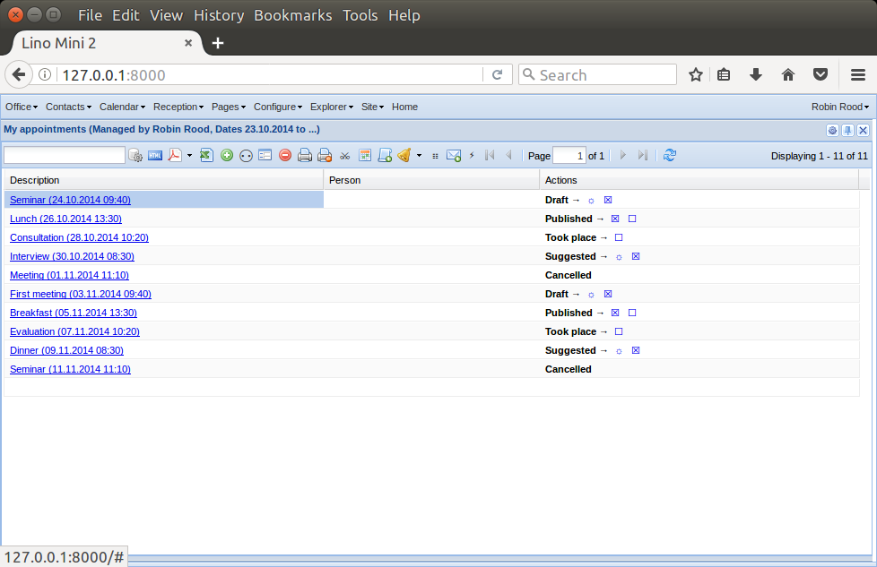
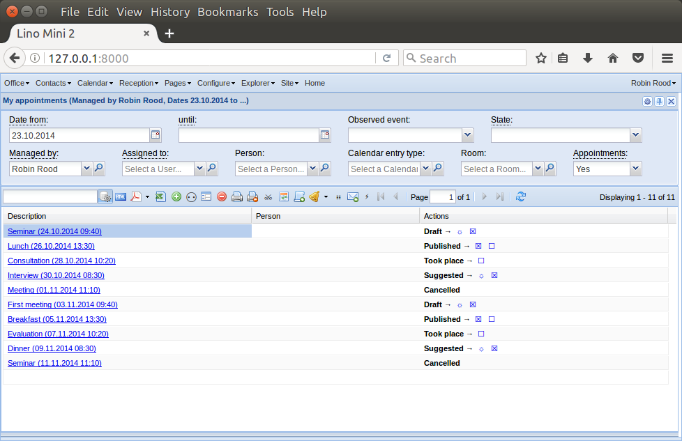

.. doctest docs/dev/parameters.rst
.. include:: /../docs/shared/include/defs.rst
.. _dev.parameters:

================================
Introduction to actor parameters
================================

Any table in Lino can have optional panel with :term:`actor parameters <actor
parameter>`.  This document explains what they are. They are both similar and
very different from :term:`action parameters <action parameter>`.

.. contents::
    :depth: 2
    :local:

.. include:: /../docs/shared/include/tested.rst

>>> from lino import startup
>>> startup('lino_book.projects.apc.settings.doctests')
>>> from lino.api.doctest import *

Introduction
============

For example, here is a `My Appointments` table, first with the
:term:`parameter panel` collapsed and then expanded:

You can toggle between these two states by clicking the |gear|  button in the
toolbar. The help text of that button says `Show or hide the table parameters`.
This button is available only on tables that do have parameters.

.. glossary::

  actor parameter

    A run-time parameter that can be given to an actor in the :term:`parameter panel`.

    Actor parameters are stored in the :attr:`parameters
    <lino.core.actors.Actor.parameters>` attribute of their :class:`Actor
    <lino.core.actors.Actor>`.

  parameter panel

    A panel used to enter :term:`actor parameters <actor parameter>` of an
    actor. In ExtJS it expands or collapses by clicking the |gear| button in the
    toolbar.

  simple actor parameter

    An :term:`actor parameter` that maps to a given database field. For example
    :attr:`lino_xl.lib.contacts.Persons.gender` is a simple actor parameter
    that, when set, will cause the table to show only persons of the gender
    given in the parameter panel. You declare them by overriding the
    :meth:`get_simple_parameters <lino.core.model.Model.get_simple_parameters>`
    method of your model.

>>> pprint(rt.models.contacts.Persons.parameters)
{'aged_from': <django.db.models.fields.IntegerField: aged_from>,
 'aged_to': <django.db.models.fields.IntegerField: aged_to>,
 'end_date': <django.db.models.fields.DateField: end_date>,
 'gender': <lino.core.choicelists.ChoiceListField: gender>,
 'observed_event': <lino.core.choicelists.ChoiceListField: observed_event>,
 'start_date': <django.db.models.fields.DateField: start_date>}

Only one of these is a simple parameter:

>>> list(rt.models.contacts.Persons.get_simple_parameters())
['gender']

For the other parameters we must override the model's
:meth:`lino.core.model.Model.get_request_queryset` method in order to tell Lino
how they influence the data to be displayed.

TODO: continue to write documentation.

- :meth:`lino.core.model.Model.get_simple_parameters`
- :meth:`lino.core.model.Model.get_parameter_fields`
- :attr:`lino.core.utils.Parametrizable.parameters`
