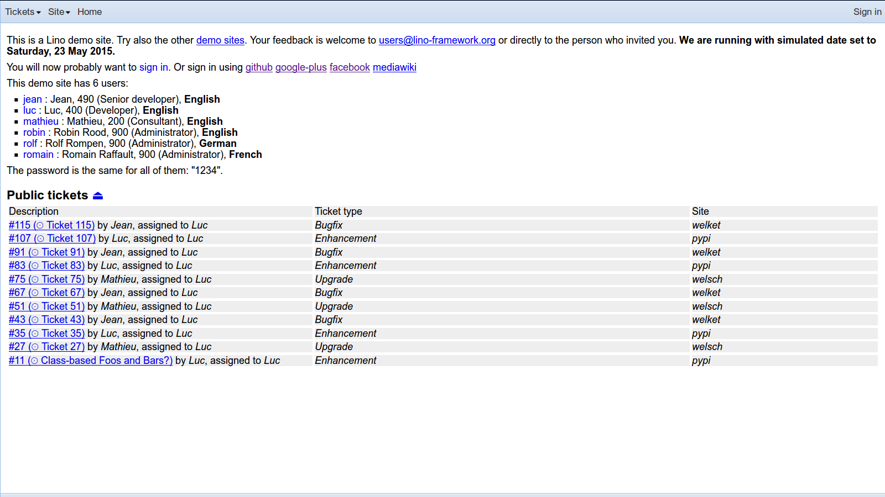
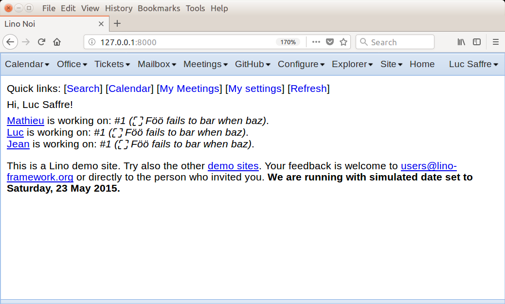
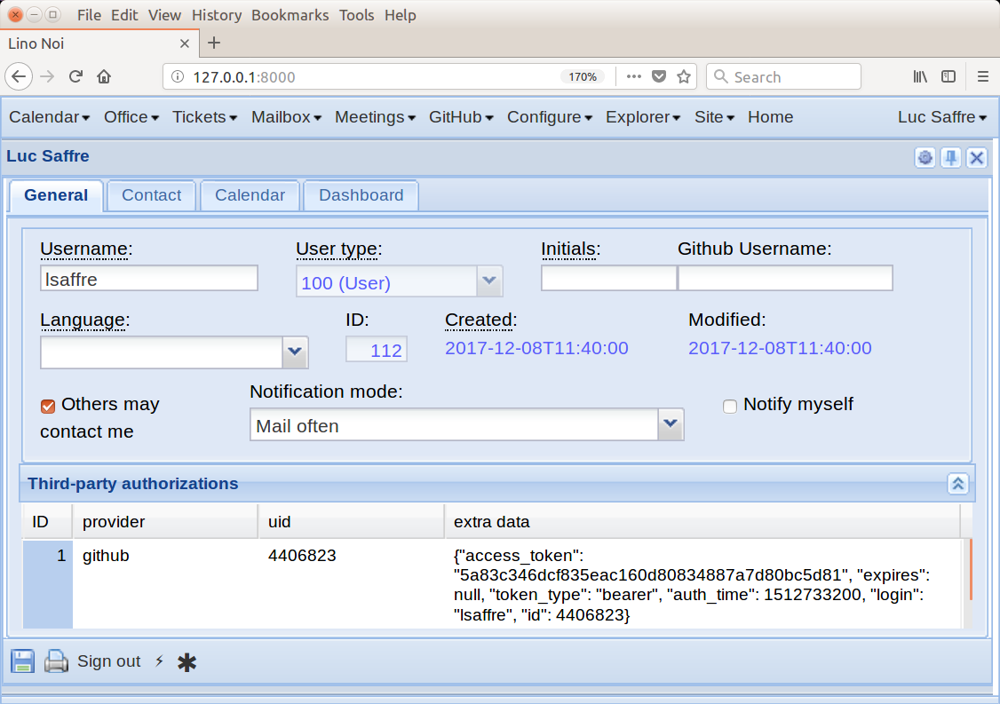
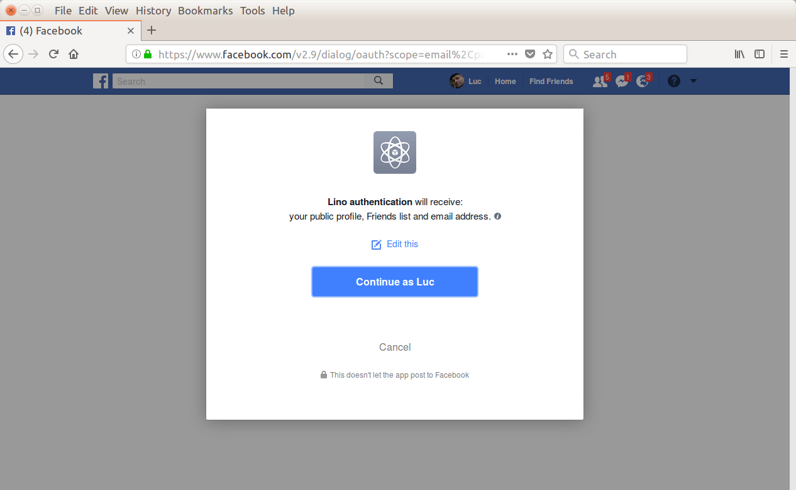
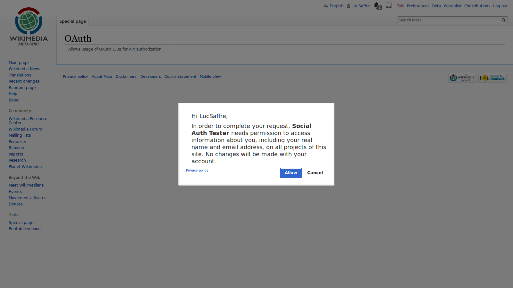

.. _lino.socialauth:

=====================
Social Authentication
=====================

In a Lino application you can easily enable third-party authentication
thanks to `Python Social Auth
<https://github.com/python-social-auth>`__ (PSA).

A working example
=================

A working example is in the :mod:`lino_book.projects.noi1e` demo
project.  If you have the :doc:`Lino developer environment </dev/install/index>`
installed, you can test the social auth functionality on your machine
by doing::

    $ go team
    $ python manage.py prep
    $ runserver

Now point your browser to http://127.0.0.1:8000/ and you should see
something like this (note the message **Or sign in using github,
google-plus facebook mediawiki**.):

    The Lino Team main page for anonymous users.

Click on **github**. This will lead you to the GitHub website:

.. figure:: socialauth2.png
    :width: 80 %

    Github asking your permission to authenticate you at the "Lino
    auth tester" app

There you must click on the big green button to tell GitHub that they
may communicate your contact data to the **Social Auth Tester**
application at http://127.0.0.1:8000/ (IOW on you own computer).

Voilà. You you are now logged in into the Lino Noi running on your
machine, authentified via your GitHub account. You can now edit your
user profile by clicking on **[My settings]**:

Here is how the confirmation page looks on Facebook:

    Facebook asking your permission to authenticate you at the "Lino
    authentication" app

Or on WikiMedia:

    WikiMedia asking your permission to authenticate you at the
    "Social Auth Tester" app

This works out of the box because we did the work of creating
applications on GitHub, Google+, Facebook and WikiMedia.  Details
about how to do that see below.

How it works
============

As the site administrator, you must chose which authentication
providers you want to offer to your users.  For each provider you will
activate the corresponding "backend".

Add the backend in your settings
--------------------------------

Available backends are listed
`in the PSA documentation
<http://python-social-auth.readthedocs.io/en/latest/backends/>`__.

In your local :xfile:`settings.py` you must set
:attr:`social_auth_backends
<lino.core.site.Site.social_auth_backends>` to a list of the backends
you want to offer on your site.  If you want GitHub, the you will
write::

      class Site(Site):
          ...
          social_auth_backends = [
             'social_core.backends.github.GithubOAuth2']

We got the name of that backend
(``social_core.backends.github.GithubOAuth2``) from the detailed
instructions page for `GitHub
<http://python-social-auth.readthedocs.io/en/latest/backends/github.html>`__.
For other backends we just looked at the code of
:mod:`social_core.backends`.

Create a consumer
-----------------

For OAuth backends you need to create a "consumer" or "application" on
the provider's website.  You tell the provider that you run a site
whose users will want to authenticate, and the provider will then give
you a "key" and a "secret".

Here are the parameters we used for creating the GitHub application:

- Application name: Social Auth Tester
- Homepage URL: http://127.0.0.1:8000/
- Authorization callback URL: http://127.0.0.1:8000/oauth/complete/github

In Facebook you must go to :menuselection:`Products --> Facebook Login
--> Settings` and enable the following:

    | **Embedded Browser OAuth Login**
    | Enables browser control redirect uri for OAuth client login.

For Wikimedia the instructions are
in the
`PSA docs
<http://python-social-auth.readthedocs.io/en/latest/backends/mediawiki.html>`__
and on the `mediawiki site
<https://www.mediawiki.org/wiki/OAuth/For_Developers>`__.

You must then store these in your :xfile:`settings.py`. For example::

    SOCIAL_AUTH_GITHUB_KEY = '...'
    SOCIAL_AUTH_GITHUB_SECRET = '...'

The client secrets of these applications we used for this toturial
aren't really secret anymore since they are stored in the
:xfile:`settings.py` of the team demo project (more exactly `here
<https://github.com/lino-framework/book/blob/master/lino_book/projects/team/settings/demo.py>`__). In
a real setup you will of course give the public URL of your website,
and you will write that secret only to the :xfile:`settings.py` on
your website.

Exercises
=========

- Note that your user type is "user" and that you cannot change this.
  Only administrators can change the user type.

- Sign out. Note that your user name is now listed below **This demo
  site has 7 users:**. This list does not show on a real site, it is
  there because :attr:`is_demo_site
  <lino.core.site.Site.is_demo_site>` is `True`.

- Note that you exist as a user, but you can sign in only through
  GitHub. You can not sign in using the
  :class:`lino.modlib.users.SignIn` dialog window because you have no
  password set.

- Sign in as robin (an administrator) and merge two users.

Note that with Lino you do  not need to set Django's
:setting:`AUTHENTICATION_BACKENDS` setting yourself, Lino will do that
for you, based on miscellaneous criteria (and
:attr:`social_auth_backends
<lino.core.site.Site.social_auth_backends>` is only one of them).

User's friends
==============

Once an user get authentified via one of official supported
third-party by Lino, we can retrieve user's public "friends".

The following is an example how you can try to see all your Google+
friends using `Google People API
<https://developers.google.com/people/>`__ after having authenticated
using GooglePlus.

To be able to use this API, we need to install `google-api-python-client`::

    pip install google-api-python-client

The demo :xfile:`settings.py` of :mod:`lino_book.projects.noi1e`
have the following things done:

- We added more scopes to `SOCIAL_AUTH_GOOGLE_PLUS_SCOPE`::

    SOCIAL_AUTH_GOOGLE_PLUS_SCOPE = [
        'profile',
        'https://www.googleapis.com/auth/plus.login',
        # Add at least one of the following scopes.
        'https://www.googleapis.com/auth/contacts.readonly', # To have just READ permission
        'https://www.googleapis.com/auth/contacts ', # To have WRITE/READ permissions
    ]

- We added `social_core.backends.google.GooglePlusAuth`
  to `social_auth_backends`.

Run the web interface on your machine and log in via Google+ as
described in `A working example`_.

Run the following script from the :mod:`lino_book.projects.noi1e`
project directory::

    python manage.py run try_people_api.py

The script uses the Google People API alongside with the credentials
captured during the user logging via GooglePlus.
