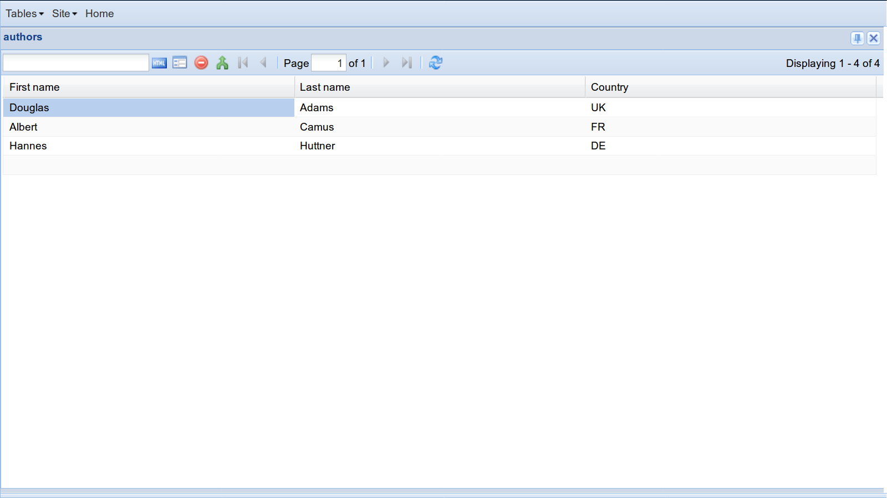
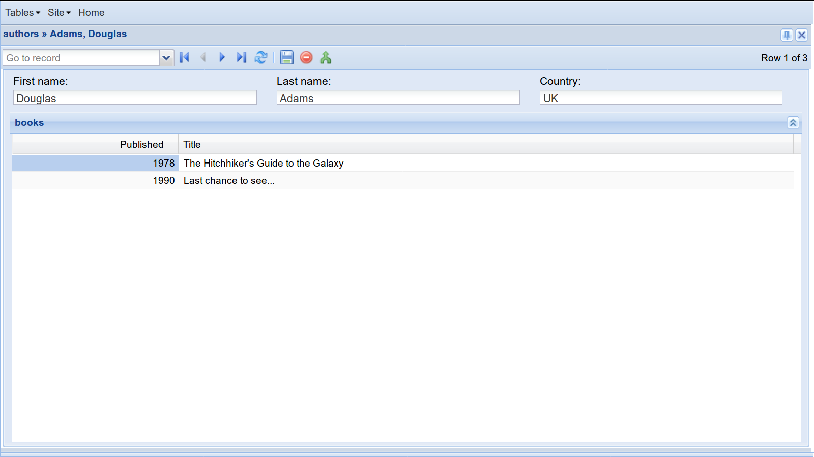

.. doctest docs/dev/tables/index.rst
.. _lino.tutorial.tables:

=========================
Introduction to tables
=========================

   
.. contents::
    :depth: 1
    :local:

What is a table?
================

A **table** displays some data in a tabular way, using cells that are
arranged in rows and columns.

In a Lino application you describe tables using Python classes.  These
Python classes are a *general* description of how to lay out your data
and can be used for different front ends.  The same table
description is used to render data interactively as a grid panel or on
a printable document as a table.

Don't mix up *models* and *tables*: while your *models* describe how
data is to be *stored in the database*, your *tables* describe how
data is to be *presented to users*.

Lino's "tables" are roughly equivalent of Django's "views".  With Lino
you don't need to write views because Lino writes them for you.
Actually a Lino table corresponds only to one type of Django's views,
sometimes referred to as "tabular" or "list" views. The other class of
views are "detail" views, for which you are going to define
:doc:`Layouts </dev/layouts/index>` (we'll talk about these later).

In Lino we differentiate between **database tables** and **virtual
tables**.  *Database tables* get their data directly from the database
using a Django model.  Virtual tables have no model, they get their
data programmatically.

Implementation note: *database tables* are subclasses of
:class:`lino.core.dbtables.Table` (generally imported via its shortcut
:mod:`dd.Table <lino.api.dd>`), *virtual tables* are subclasses of
:class:`lino.core.tables.VirtualTable` (generally imported via its
shortcut :mod:`dd.VirtualTable <lino.api.dd>`).  The classes have a
common abstract base class :class:`lino.core.tables.AbstractTable`.

The remainder of this tutorial concentrates on
*database tables*, :doc:`virtual tables </dev/vtables>` have a
tutorial on their own.
     

Illustration
============
     
To illustrate this, we will have a look at the
:mod:`lino_book.projects.tables` demo application.

Here are the **database models**:

.. literalinclude:: /../../book/lino_book/projects/tables/models.py

And here are the **tables**:

.. literalinclude:: /../../book/lino_book/projects/tables/desktop.py

Tables can be defined either together with the database models in your
:xfile:`models.py`, or in a separate file named :xfile:`desktop.py`.

Tables are subclasses of :class:`dd.Table <lino.core.dbtables.Table>`.
You don't need to instantiate them, Lino loads them automatically at
startup and they are globally available at runtime in the
:mod:`lino.api.rt` module.

>>> from lino import startup
>>> startup('lino_book.projects.tables.settings')
>>> from lino.api import rt, dd
>>> rt.models.tables.Books
lino_book.projects.tables.desktop.Books
>>> issubclass(rt.models.tables.Books, dd.Table)
True

There can be more than one table for a given model, but each table has
exactly one model as its data source.  That model is specified in the
:attr:`model <lino.core.dbtables.Table.model>` attribute of the table.
For every database model there should be at least one table.  Lino
will generate a default table for models that have no table at all.

.. Note that there may be *more than one table* for a given
   model. That's a fundamental difference from Django's concept of the
   `ModelAdmin` class and `Model._meta` options.

Much information about your table is automatically extracted from the
model: the **columns** correspond to the *fields* of your database
model.  The **header** of every column is the `verbose_name` of its
field.  The values in a column are of same **data type** for each
row. So Lino knows all these things from your models.

The **rows** of a table can be **sorted** and **filtered**. These are
things which are done in Django on a QuerySet.  Lino doesn't reinvent
the wheel here and just forwards them to their corresponding Django
methods: :attr:`order_by <lino.core.tables.AbstractTable.order_by>`,
:attr:`filter <lino.core.tables.AbstractTable.filter>` and
:attr:`exclude <lino.core.tables.AbstractTable.exclude>`.

But here is something you cannot express on a Django model: *which*
columns are to be shown, and how they are ordered.  This is defined by
the :attr:`column_names <lino.core.tables.AbstractTable.column_names>`
attribute, a simple string with a space-separated list of field names.

Tables can hold information which goes beyond a model or a
queryset. For example we set :attr:`hide_sums
<lino.core.tables.AbstractTable.hide_sums>` to `True` on the ``Books``
table because otherwise Lino would display a sum for the "published"
column.

Designing your tables
=====================

Database *models* are usually named in *singular* form, tables in
*plural* form.

Tables may inherit from other tables (e.g. ``BooksByAuthor`` inherits
from ``Books``: it is basically a list of books, with the difference
that it shows only the books of a given author.

The recommended place for defining tables is in a separate file
:file:`desktop.py`.  You might define your tables together with the
models in your :file:`models.py` file, but in that case your
application has no chance to support :ref:`responsive design
<lino.dev.design>`.

As a rule of thumb you can say that you need one table for every *grid
view* used in your application. Each table is a subclass of
:class:`dd.Table <lino.core.dbtables.Table>`.

To define tables, you simply need to declare their classes.  Lino
discovers and analyzes them when it initializes.  Tables never get
instantiated.

Each table class must have at least one class attribute :attr:`model
<lino.core.dbtables.Table.model>` which points to the model on which
this table will "work". Every row of a table represents an instance of
its model. (This is true only for *database* tables. Lino also has
*virtual* tables, we will talk about them in a later tutorial.

Since tables are normal Python classes they can use inheritance.  In
our code `BooksByAuthor` inherits from `Books`.  That's why we don't
need to explicitly specify a `model` attribute for `BooksByAuthor`.

`BooksByAuthor` is an example of a :ref:`slave table <slave_tables>`.
It shows the books of a given `Author`.  This given Author is called
the "master" of these Books.  We also say that a slave table *depends*
on its master.

Lino manages this dependency almost automatically.  The application
developer just needs to specify a class attribute :attr:`master_key
<lino.core.tables.AbstractTable.master_key>`.  This attribute, when
set, must be a string containing the name of a `ForeignKey` field
which must exist in the Table's model.

A table can defined attributes like :attr:`filter
<lino.core.tables.AbstractTable.filter>` and :attr:`order_by
<lino.core.tables.AbstractTable.order_by>` which you know from Django's
`QuerySet API
<https://docs.djangoproject.com/en/3.1/ref/models/querysets/>`_.

A table is like a grid widget, 
it has attributes like :attr:`column_names
<lino.core.tables.AbstractTable.column_names>` which describe how to
display it to the user.

But the table is even more than the definition of a grid widget.  It
also has attributes like :attr:`detail_layout
<lino.core.actors.Actor.detail_layout>` which tells it how to display
the detail of a single record in a form view.

Try also to work through the API docs, 
knowing that
:class:`lino.core.dbtables.Table` 
inherits from
:class:`lino.core.tables.AbstractTable` 
who inherits from
:class:`lino.core.actors.Actor`.

Using tables without a web server
=================================

An important thing with tables is that they are independent of any
front end. You define them once, and you can use them on the
console, in a script, in a testcase, in a web interface or in a GUI
window.

At this point of our tutorial, we won't yet fire up a web browser
(because we want to explain a few more concepts like menus and layouts
before we can do that), but we can already play with our data using
Django's console shell::

  $ python manage.py shell

The first thing you do in a :manage:`shell` session is to import
everything from :mod:`lino.api.shell`:

>>> from lino.api.shell import *

This imports especially a name ``rt`` which points to the
:mod:`lino.api.rt` module.  ``rt`` stands for "run time" and it
exposes Lino's runtime API.  In our first session we are going to use
the :meth:`show <lino.api.rt.show>` method and the :meth:`actors
<lino.core.site.Site.actors>` object.

>>> rt.show(tables.Authors)
... #doctest: +NORMALIZE_WHITESPACE +REPORT_UDIFF
============ =========== =========
 First name   Last name   Country
------------ ----------- ---------
 Douglas      Adams       UK
 Albert       Camus       FR
 Hannes       Huttner     DE
============ =========== =========
<BLANKLINE>

So here is, our ``Authors`` table, in a testable console format!

And here is the ``Books`` table:

>>> rt.show(tables.Books)
... #doctest: +NORMALIZE_WHITESPACE +REPORT_UDIFF
================= ====================================== ===========
 author            Title                                  Published
----------------- -------------------------------------- -----------
 Adams, Douglas    Last chance to see...                  1990
 Adams, Douglas    The Hitchhiker's Guide to the Galaxy   1978
 Huttner, Hannes   Das Blaue vom Himmel                   1975
 Camus, Albert     L'etranger                             1957
================= ====================================== ===========
<BLANKLINE>

These were so-called **master tables**.  We can also show the content
of :ref:`slave tables <slave_tables>` :

>>> adams = tables.Author.objects.get(last_name="Adams")
>>> rt.show(tables.BooksByAuthor, adams)
... #doctest: +NORMALIZE_WHITESPACE +REPORT_UDIFF
=========== ======================================
 Published   Title
----------- --------------------------------------
 1978        The Hitchhiker's Guide to the Galaxy
 1990        Last chance to see...
=========== ======================================
<BLANKLINE>

Before going on, please note that the preceding code snippets are
**tested** as part of Lino's test suite.  This means that as a core
developer you can run a command (:cmd:`inv test` in case you are
curious) which will parse the source file of this page, execute every
line that starts with ``>>>`` and verifies that the output is the same
as in this document.  If a single dot changes, the test "fails" and
the developer will find out the reason.

Writing test cases is an important part of software development.  It
might look less funny than developing cool widgets, but actually these
are part of analyzing and describing how your users want their data to
be structured.  Which is the more important part of software
development.

Defining a web interface
========================

The last piece of the user interface is the *menu definition*, located
in the :xfile:`__init__.py` file ot this tutorial:

.. literalinclude:: /../../book/lino_book/projects/tables/__init__.py

Every plugin of a Lino application can define its own subclass of
:class:`lino.core.plugin.Plugin`, and Lino instantiates these objects
automatically a startup, even before importing your database models.

You might ask "Why can't we just define the menu commands in our
:xfile:`settings.py` or the :xfile:`models.py` files? That question
goes beyond the scope of this tutorial

Note that a plugin corresponds to what Django calls an application.
More about this in :ref:`dev.plugins`.

About this tutorial
===================

You can interactively play around with the little application used in
this tutorial::

  $ go tables
  $ python manage.py runserver

Some screenshots:
                    

                    

The :file:`fixtures/demo.py` file contains the data we used to fill
our database:

.. literalinclude:: /../../book/lino_book/projects/tables/fixtures/demo.py

Exercises
=========

Explore the application and try to extend it: change things in the
code and see what happens.

