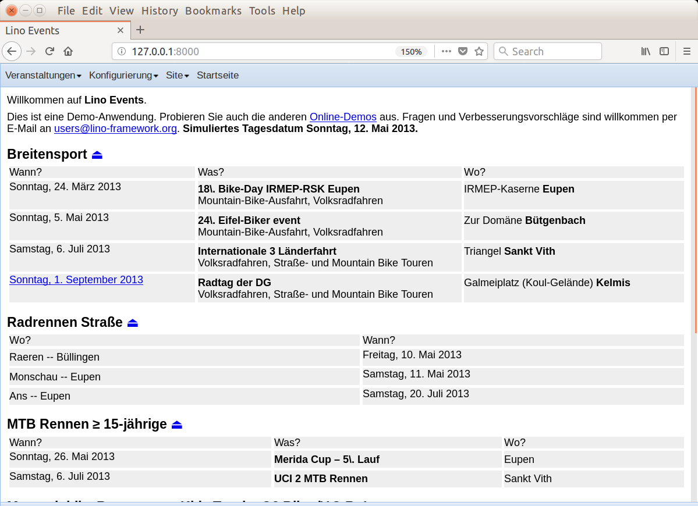

.. doctest docs/specs/events.rst
.. _book.specs.events:

===================================================
``events`` : Generating a static calendar of events
===================================================

..  doctest init:
    
    >>> from lino import startup
    >>> startup('lino_book.projects.events.settings')
    >>> from lino.api.doctest import *

This plugin was written for a project which is now stalled. But it
remains interesting because it has an example of a table with variable
table handle: per event type you can specify which columns are to
appear in the EventsByType slave table.

Test the content of the admin main page.

>>> # test_client.force_login(rt.login('rolf').user)
>>> # res = test_client.get('/api/main_html', REMOTE_USER='rolf')
>>> res = test_client.get('/api/main_html')
>>> print(res.status_code)
200
>>> result = json.loads(res.content.decode())
>>> result['success']
True
>>> # print(html2text(result['html']))
>>> soup = BeautifulSoup(result['html'], 'lxml')

We might test the complete content here, but currently we skip this as
it is much work to maintain.

>>> print(soup.get_text(' ', strip=True))
... #doctest: +NORMALIZE_WHITESPACE +REPORT_CDIFF +SKIP

>>> links = soup.find_all('a')
>>> len(links)
8

>>> tables = soup.find_all('table')
>>> len(tables)
4

>>> for h in soup.find_all('h2'):
...     print(h.text.strip())
Breitensport ⏏
Radrennen Straße ⏏
MTB Rennen ≥ 15-jährige ⏏
Mountainbike Rennsport -- Kids Trophy O2 Biker/V.O.R.-Lotto ⏏

