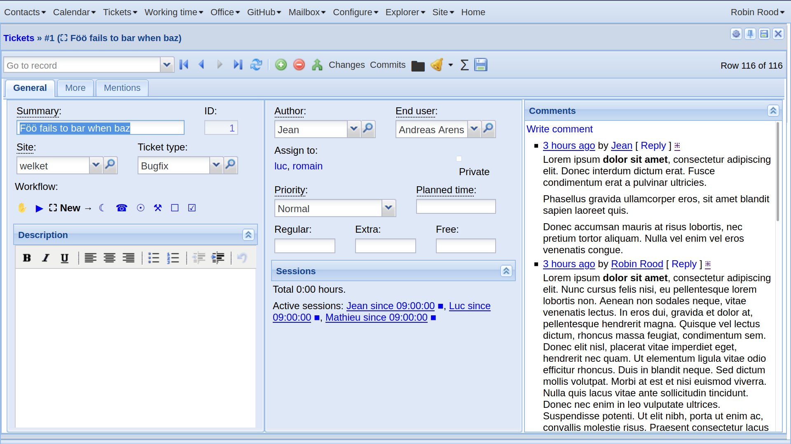

.. doctest docs/specs/noi/std.rst
.. _noi.specs.std:

================================
About rendering action URLs
================================

This document is about the :attr:`is_on_main_actor
<lino.core.requests.BaseRequest.is_on_main_actor>` attribute of an action
request.

.. contents::
  :local:

.. include:: /../docs/shared/include/tested.rst

>>> from lino import startup
>>> startup('lino_book.projects.team.settings.doctests')
>>> from lino.api.doctest import *

Screenshot
==========

This document uses the detail view of ticket #1 in the team demo. Here is how
this window looks in ExtJS:

The "Sessions" panel in this screen (the :class:`SessionsByTicket
<lino_noi.lib.working.SessionsByTicket>` slave table, which has its
:attr:`display_mode <lino.core.actors.Actor.display_mode>` set to 'summary')
shows that three users are currently working on this ticket.   For each of these
open sessions, you can either open the session itself (its detail window), or
invoke its end_session action.

This summary of :class:`SessionsByTicket
<lino_noi.lib.working.SessionsByTicket>` adds the total duration and a list of
the active sessions. In case you wonder how this summary is being generated,
please consult the source code.

Why we need ``is_on_main_actor``
================================

When you render an action button, you get a clickable html element that, when
clicked, executes a given action.

The :attr:`lino_xl.lib.working.Session.end_session` action on a ticket is a
non-window custom action. Such an action has no parameters and therefore does
not open any popup window before executing, so clicking on such a button should
immediately execute it.

In ExtJS, these actions are implemented as global JS functions that just call the
global `Lino.run_row_action` function which is defined in :xfile:`linoweb.js`.

The action itself still runs on the server, so `Lino.run_row_action` sends an
AJAX request.

That AJAX request needs to pass certain information that is available only in
the JS client, e.g. the selected row, the requesting panel or the base
parameters. But this should not happen (and would cause errors)
for actions on a slave table.

We do not want `Lino.run_row_action` to add the parameter values of its
requesting panel when it is being run from within a "non-main context". A
"non-main context" is for example in
:meth:`lino.core.actors.Actor.slave_as_html_meth` (i.e. when :attr:`display_mode
<lino.core.actors.Actor.display_mode>` is ``html``.

Note that currently we also don't pass the mk and mt parameters
(master key and master type). I think that this is correct.

Let `A` be our slave table (an actor) and `obj` the master instance for this
slave table.

>>> A = working.SessionsByTicket
>>> obj = tickets.Ticket.objects.get(pk=1)

Here is how to simulate the content of this panel in a doctest.

>>> ses = rt.login('robin')
>>> ses.show(A, obj)
Total 0:00 hours.
Active sessions: `Jean since 09:00:00 <Detail>`__ **■**, `Luc since 09:00:00 <Detail>`__ **■**, `Mathieu since 09:00:00 <Detail>`__ **■**

In order to look at the href links generated by a JavaScript renderer, we
simulate a web session by specifying the default renderer, which is an instance
of :class:`lino.modlib.extjs.ext_renderer.ExtRenderer`, a subclass of
:class:`lino.core.renderer.JsRenderer`.

>>> settings.SITE.kernel.default_renderer  #doctest: +ELLIPSIS
<lino.modlib.extjs.ext_renderer.ExtRenderer object at ...>

>>> ses = rt.login('robin', renderer=settings.SITE.kernel.default_renderer)

Now the :meth:`lino.core.requests.BaseRequest.show` method no longer prints
plain text to the stdout but a HTML string:

>>> ses.show(A, obj)  #doctest: +ELLIPSIS +NORMALIZE_WHITESPACE
'

Total 0:00 hours.

Active sessions:
<a href="javascript:Lino.working.SessionsByTicket.detail.run(null,{ &quot;record_id&quot;: 1 })">Jean since 09:00:00</a>
<a style="text-decoration:none" title="See EndTicketSession."
href="javascript:Lino.working.Sessions.end_session(null,false,1,{ ...'

>>> ses.is_on_main_actor
True
>>> ar = rt.models.tickets.Tickets.request(parent=ses)
>>> ar.is_on_main_actor
True
>>> ar.actor
lino_xl.lib.tickets.ui.Tickets

>>> # ar.request = 123
>>> html = A.get_table_summary(obj, ar)

The href links in this html must be javascript links, not external ones.

>>> print(tostring(html))  #doctest: +ELLIPSIS +NORMALIZE_WHITESPACE

Total 0:00 hours.

Active sessions:
<a href="javascript:Lino.working.Sessions.detail.run(null,{ &quot;record_id&quot;: 1 })">Jean since 09:00:00</a>
...

Let's make this more readable:

>>> soup = BeautifulSoup(tostring(html), 'lxml')
>>> # print(soup.body.prettify())
>>> links = soup.body.find_all('a')
>>> len(links)
6

>>> for lnk in links:
...    print(lnk['href'])  #doctest: +ELLIPSIS
javascript:Lino.working.Sessions.detail.run(null,{ "record_id": 1 })
javascript:Lino.working.Sessions.end_session(null,false,1,{...})
javascript:Lino.working.Sessions.detail.run(null,{ "record_id": 5 })
javascript:Lino.working.Sessions.end_session(null,false,5,{...})
javascript:Lino.working.Sessions.detail.run(null,{ "record_id": 9 })
javascript:Lino.working.Sessions.end_session(null,false,9,{...})
