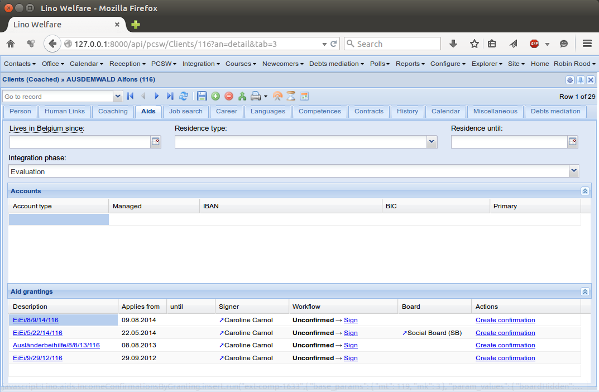
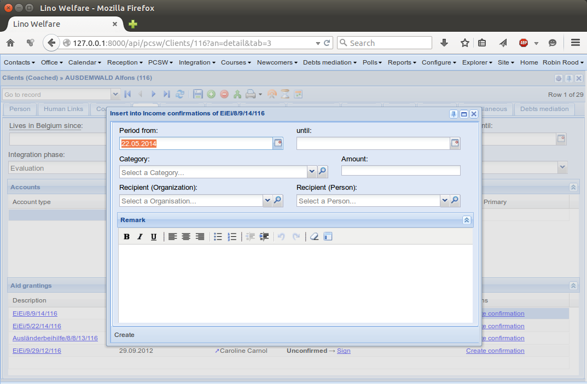
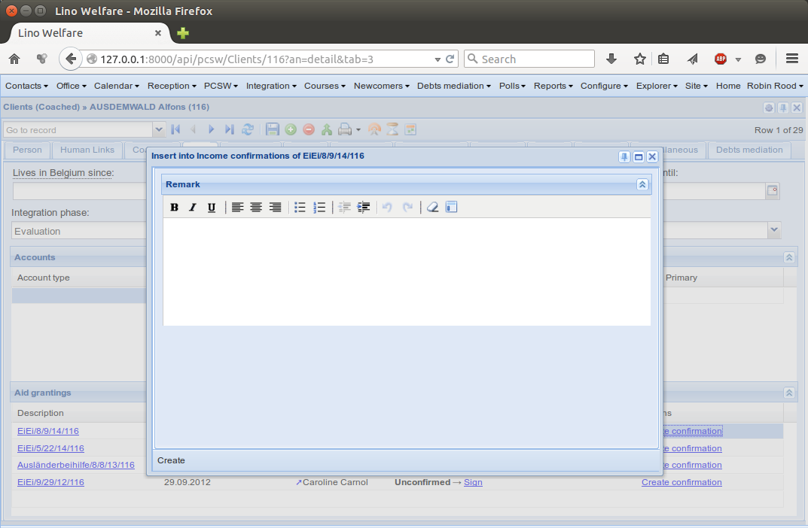

.. doctest docs/specs/welfare/aids/index.rst
.. _welfare.specs.aids:

======================
The Social Aids module
======================

This document describes the functionality implemented by the
:mod:`lino_welfare.modlib.aids` plugin.

.. currentmodule:: lino_welfare.modlib.aids
     

.. contents::
   :local:
   :depth: 2

>>> from lino import startup
>>> startup('lino_book.projects.gerd.settings.doctests')
>>> from lino.api.doctest import *

>>> translation.activate('de')
           

Confirmation types
==================

>>> from lino_welfare.modlib.pcsw.roles import SocialUser
>>> ses = rt.login('alicia')
>>> ses.user.user_type.has_required_roles([SocialUser])
True

:class:`ConfirmationTypes
<lino_welfare.modlib.aids.choicelists.ConfirmationTypes>` is a
choicelist where each subclass of :class:`Confirmation
<lino_welfare.modlib.aids.mixins.Confirmation>`
has been registered. 

Currently Lino Welfare knows three confirmation types.

>>> ses.show(aids.ConfirmationTypes)
... #doctest: +ELLIPSIS +NORMALIZE_WHITESPACE -REPORT_UDIFF
====== ========================= =================================================== =============
 name   Wert                      Text                                                Vorlage
------ ------------------------- --------------------------------------------------- -------------
        aids.SimpleConfirmation   Einfache Bescheinigung (aids.SimpleConfirmation)    Default.odt
        aids.IncomeConfirmation   Einkommensbescheinigung (aids.IncomeConfirmation)   Default.odt
        aids.RefundConfirmation   Kostenübernahmeschein (aids.RefundConfirmation)     Default.odt
====== ========================= =================================================== =============
<BLANKLINE>

Aid types
==========

Every aid granting has a type, and the list of **aid types** is
configurable.

This list can be modified by a user with admin level.

>>> rt.login("robin").show_menu_path(aids.AidTypes)
Configure --> PCSW --> Aid Types

>>> rt.login("rolf").show_menu_path(aids.AidTypes)
Konfigurierung --> ÖSHZ --> Hilfearten

>>> ses.show(aids.AidTypes, column_names="name confirmed_by_primary_coach body_template id")
... #doctest: +ELLIPSIS +NORMALIZE_WHITESPACE +REPORT_UDIFF
================================================= =========================== =============================== ====
 Bezeichnung                                       Primärbegleiter bestätigt   Textkörper-Vorlage              ID
------------------------------------------------- --------------------------- ------------------------------- ----
 Ausländerbeihilfe                                 Ja                          foreigner_income.body.html      2
 Dringende Medizinische Hilfe                      Ja                          urgent_medical_care.body.html   7
 Eingliederungseinkommen                           Ja                          integ_income.body.html          1
 Erstattung                                        Ja                          certificate.body.html           4
 Feste Beihilfe                                    Ja                          fixed_income.body.html          3
 Heizkosten                                        Ja                          heating_refund.body.html        9
 Kleiderkammer                                     Ja                          clothing_bank.body.html         11
 Lebensmittelbank                                  Nein                        food_bank.body.html             10
 Möbellager                                        Ja                          furniture.body.html             8
 Übernahme von Arzt- und/oder Medikamentenkosten   Ja                          medical_refund.body.html        6
 Übernahmeschein                                   Ja                          certificate.body.html           5
================================================= =========================== =============================== ====
<BLANKLINE>

.. class:: AidType
           
    The Django model representing an *aid type*.
    
    Database fields:

    .. attribute:: short_name

        The short name for internal use, e.g. when a user must select
        an aid type from a combobox.

    .. attribute:: confirmation_type

        The database model to use for issuing an aid confirmation of
        this type. This is a mandatory pointer to
        :class:`ConfirmationTypes`.
    
    .. attribute:: name

        The designation of this aid type as seen by the user e.g. when
        selecting an aid type.

        One field for every :attr:`language <lino.core.site.Site.language>`.

    .. attribute:: excerpt_title

        The text to print as title in confirmations.
        See also
        :attr:`lino_xl.lib.excerpts.mixins.ExcerptTitle.excerpt_title`.

    .. attribute:: body_template

        The body template to use when printing a confirmation of this type.
        If this field is empty, Lino uses the excerpt type's
        :attr:`body_template
        <lino_xl.lib.excerpts.models.ExcerptType.body_template>`.
        See also :doc:`/admin/printing`.

    .. attribute:: is_urgent

        Whether aid grantings of this type are considered as urgent.
        This is used by :meth:`Confirmation.get_urgent_granting`

    .. attribute:: is_integ_duty

    .. attribute:: board

        Pointer to the default :class:`lino_xl.lib.boards.models.Board`
        for aid projects of this type.

    .. attribute:: confirmed_by_primary_coach
    
        Whether grantings for this aid type are to be signed by the
        client's primary coach (see :meth:`Client.get_primary_coach
        <lino_welfare.modlib.pcsw.models.Client.get_primary_coach>`).

    .. attribute:: pharmacy_type

        A pointer to the :class:`ClientContactType
        <lino_xl.lib.clients.ClientContactType>` to be used when
        selecting the pharmacy of a refund confirmation
        (:attr:`RefundConfirmation.pharmacy`).

Aid grantings (Hilfebeschlüsse)
===============================

An **aid granting** is the principal promise that a given client
gets a given aid during a given period.

.. class:: Granting

    The Django model representing an *aid granting*.

    Database fields:

    .. attribute:: client

        Pointer to the :class:`lino_welfare.modlib.pcsw.models.Client`.

    .. attribute:: aid_type

        The type of aid being granted. Mandatory.
        Pointer to the :class:`AidType`.

    .. attribute:: signer

        Pointer to the user who is expected to "sign" this granting
        (i.e. to confirm that it is real).

        The default value is the client's primary coach for grantings
        whose :attr:`aid_type` has :attr:`confirmed_by_primary_coach
        <AidType.confirmed_by_primary_coach>` checked.

    .. attribute:: board

        Pointer to the :class:`Board <lino_xl.lib.boards.models.Board>`
        which decided to allocate this aid project.

    .. attribute:: category

        Currently only used for printing an `isip.Contract`.

        
.. class:: Grantings
.. class:: AllGrantings
.. class:: MyPendingGrantings
.. class:: GrantingsByClient
.. class:: GrantingsByType
        
           

Alicia hat 2 Hilfebeschlüsse zu bestätigen. Dies kriegt sie als
Willkommensmeldung unter die Nase gerieben:

>>> ses = rt.login('alicia')
>>> translation.activate('de')
>>> for msg in settings.SITE.get_welcome_messages(ses):
...     print(tostring(msg))
... #doctest: +ELLIPSIS +NORMALIZE_WHITESPACE -REPORT_UDIFF
Du bist beschäftigt in <a href="Detail">Beschwerde (22.05.2014) mit COLLARD Charlotte (118)</a> (<b>☑</b>). 
Du hast <b>6 Einträge in Zu bestätigende Hilfebeschlüsse</b>.
<b>Du hast 3 offene Datenprobleme.</b>

When she clicks the link "Zu bestätigende Hilfebeschlüsse", then they show up:

>>> ses.show(aids.MyPendingGrantings)
... #doctest: +ELLIPSIS +NORMALIZE_WHITESPACE -REPORT_UDIFF
======================== ========================= =========== ============== ========== ======= ==============================
 Klient                   Hilfeart                  Kategorie   Laufzeit von   bis        Autor   Workflow
------------------------ ------------------------- ----------- -------------- ---------- ------- ------------------------------
 DUBOIS Robin (179)       Eingliederungseinkommen               23.07.14                          [Bestätigen] **Unbestätigt**
 DUBOIS Robin (179)       Ausländerbeihilfe                     22.06.14                          [Bestätigen] **Unbestätigt**
 EMONTS-GAST Erna (152)   Heizkosten                            30.05.14       31.05.14           [Bestätigen] **Unbestätigt**
 DA VINCI David (165)     Eingliederungseinkommen               23.05.14                          [Bestätigen] **Unbestätigt**
 DUBOIS Robin (179)       Eingliederungseinkommen               26.02.13                          [Bestätigen] **Unbestätigt**
 DA VINCI David (165)     Ausländerbeihilfe                     27.01.13                          [Bestätigen] **Unbestätigt**
======================== ========================= =========== ============== ========== ======= ==============================
<BLANKLINE>

Aid confirmations (Hilfebestätigungen)
======================================

.. class:: Confirmation

    Base class for all aid confirmations.

    Subclassed by :class:`SimpleConfirmation
    <lino_welfare.modlib.aids.models.SimpleConfirmation>`,
    :class:`IncomeConfirmation
    <lino_welfare.modlib.aids.models.IncomeConfirmation>` and
    :class:`RefundConfirmation
    <lino_welfare.modlib.aids.models.RefundConfirmation>`.

    .. method:: get_date_range_veto(self)
    
        Return an error message if this confirmation lies outside of
        granted period.

    .. method:: def get_urgent_granting(self):

        Return the one and only one urgent aid granting for the client and
        period defined for this confirmation.  Return None if there is
        no such granting, or if there is more than one such granting.

        Used in :xfile:`medical_refund.body.html`.

                
           

In der Demo-Datenbank gibt es 2 generierte Bescheinigungen pro Hilfeart :

>>> translation.activate('de')
>>> for at in aids.AidType.objects.exclude(confirmation_type='').order_by('id'):
...    M = at.confirmation_type.model
...    qs = M.objects.filter(granting__aid_type=at)
...    obj = qs[0]
...    txt = obj.confirmation_text()
...    txt = ' '.join(txt.split())
...    print("%s : %d" % (str(at), qs.count()))
Eingliederungseinkommen : 20
Ausländerbeihilfe : 35
Feste Beihilfe : 3
Erstattung : 3
Übernahmeschein : 3
Übernahme von Arzt- und/oder Medikamentenkosten : 6
Dringende Medizinische Hilfe : 6
Möbellager : 3
Heizkosten : 3
Lebensmittelbank : 3
Kleiderkammer : 4

Grantings by ISIP contract
==========================

The :meth:`get_aid_type<welfare.isip.ContractBase.get_aid_type>`
method of a contract (called from the `.odt` document template when
printing a :mod:`welfare.isip.Contract` in Eupen) works only when
:meth:`get_granting <welfare.isip.ContractBase.get_granting>` returns
exactly one granting.  Which is the normal situation.

The demo fixtures generate some exceptions to this general rule.  Here
we see that most contracts have indeed exactly 1 granting:

>>> isip.Contract.objects.all().count()
33

>>> l = []
>>> for con in isip.Contract.objects.all():
...     if con.get_aid_type() is not None:
...         l.append(con.id)
>>> print(l)
[1, 3, 4, 7, 9, 10, 11, 12, 14, 17, 18, 19, 22, 24, 27, 29, 32]

>>> rr = aids.IncomeConfirmationsByGranting.insert_action.action.required_roles
>>> print(rt.login("rolf").get_user().user_type.has_required_roles(rr))
True

>>> ct = contenttypes.ContentType.objects.get_for_model(aids.Granting)
>>> mt = ct.pk
>>> mk = 3

>>> ct = contenttypes.ContentType.objects.get(pk=mt)
>>> ct.model_class()
<class 'lino_welfare.modlib.aids.models.Granting'>

>>> obj = aids.Granting.objects.get(pk=mk)
>>> obj
Granting #3 ('EiEi/09.10.12/124')

This granting has been confirmed once:

>>> rt.show(aids.IncomeConfirmationsByGranting, obj)
==== ============================ ================ ============ ============= =====
 ID   Klient                       Kategorie        Betrag       Periode vom   bis
---- ---------------------------- ---------------- ------------ ------------- -----
 4    DOBBELSTEIN Dorothée (124)   Zusammenlebend   456,00       09.10.12
                                                    **456,00**
==== ============================ ================ ============ ============= =====
<BLANKLINE>

Permissions
===========

We test whether Theresia is allowed to create an income confirmation.

>>> theresia = rt.login('theresia').user
>>> headers = dict(HTTP_X_REQUESTED_WITH='XMLHttpRequest')
>>> headers.update(REMOTE_USER='rolf')
>>> url = "/api/aids/IncomeConfirmationsByGranting"
>>> url += "?su={2}&mt={0}&mk={1}&an=insert".format(mt, mk, theresia.pk)
>>> test_client.force_login(rt.login('rolf').user)
>>> res = test_client.get(url, **headers)
>>> print(res.status_code)
200

>>> soup = BeautifulSoup(res.content, 'lxml')
>>> scripts = soup.head.find_all('script', type="text/javascript")

The page header includes a lot of scripts:

>>> len(scripts)
21

Here are the default values for their source URLs:

>>> for s in scripts:
...     print(s.get('src', '(inline)'))  #doctest: +REPORT_UDIFF
/static/ext-3.3.1/adapter/ext/ext-base-debug.js
/static/ext-3.3.1/ext-all-debug.js
/static/ext-3.3.1/src/locale/ext-lang-de.js
/static/ext-3.3.1/examples/ux/statusbar/StatusBar.js
/static/extjs/Ext.ux.form.DateTime.js
/static/extensible-1.0.1/extensible-all-debug.js
/static/extensible-1.0.1/src/locale/extensible-lang-de.js
/static/tinymce-3.5.11/tiny_mce.js
/static/byteforce/Ext.ux.TinyMCE.js
/static/ext-3.3.1/examples/ux/gridfilters/menu/RangeMenu.js
/static/ext-3.3.1/examples/ux/gridfilters/menu/ListMenu.js
/static/ext-3.3.1/examples/ux/gridfilters/GridFilters.js
/static/ext-3.3.1/examples/ux/gridfilters/filter/Filter.js
/static/ext-3.3.1/examples/ux/gridfilters/filter/StringFilter.js
/static/ext-3.3.1/examples/ux/gridfilters/filter/DateFilter.js
/static/ext-3.3.1/examples/ux/gridfilters/filter/ListFilter.js
/static/ext-3.3.1/examples/ux/gridfilters/filter/NumericFilter.js
/static/ext-3.3.1/examples/ux/gridfilters/filter/BooleanFilter.js
/static/ext-3.3.1/examples/ux/fileuploadfield/FileUploadField.js
/media/cache/js/lino_210_de.js
(inline)

We are interested in the last one, which defines the `onReady` function:

>>> on_ready = str(scripts[-1])
>>> len(on_ready.splitlines())
13

And one of these lines calls the Javascript version of the insert
action of :class:`IncomeConfirmationsByGranting
<lino_welfare.modlib.aids.models.IncomeConfirmationsByGranting>`:

>>> "Lino.aids.IncomeConfirmationsByGranting.insert.run" in on_ready
True

The pharmacy of a RefundConfirmation
====================================

The demo database has exactly one AidType with a nonempty
`pharmacy_type` field:

>>> at = aids.AidType.objects.get(pharmacy_type__isnull=False)
>>> at
AidType #6 ('\xdcbernahme von Arzt- und/oder Medikamentenkosten')
>>> at.pharmacy_type
ClientContactType #1 ('Apotheke')

There are 4 pharmacies altogether:

>>> rt.login('robin').show('clients.PartnersByClientContactType', at.pharmacy_type)
=================================== ===== ==================================================================================
 Name                                ID    Ansicht als
----------------------------------- ----- ----------------------------------------------------------------------------------
 Apotheke Reul                       200   `Organisation <Detail>`__ [**❌**], **Partner**, Person [**➕**], Haushalt [**➕**]
 Apotheke Schunck                    201   `Organisation <Detail>`__ [**❌**], **Partner**, Person [**➕**], Haushalt [**➕**]
 Bosten-Bocken A                     203   `Organisation <Detail>`__ [**❌**], **Partner**, Person [**➕**], Haushalt [**➕**]
 Pharmacies Populaires de Verviers   202   `Organisation <Detail>`__ [**❌**], **Partner**, Person [**➕**], Haushalt [**➕**]
=================================== ===== ==================================================================================
<BLANKLINE>

There are two grantings with this aid type:

>>> rt.show(aids.GrantingsByType, at)
==================== ==================== ============== ========== ====
 Hilfebeschluss       Klient               Laufzeit von   bis        ID
-------------------- -------------------- -------------- ---------- ----
 *AMK/27.05.14/139*   JONAS Josef (139)    27.05.14       26.06.14   44
 *AMK/27.05.14/141*   KAIVERS Karl (141)   27.05.14       27.05.14   45
==================== ==================== ============== ========== ====
<BLANKLINE>

Usually there is at most one pharmacy among the client's client
contacts:

>>> rt.show(clients.ContactsByClient, pcsw.Client.objects.get(id=139))
==================== =============== =================== =============
 Klientenkontaktart   Organisation    Kontaktperson       Bemerkungen
-------------------- --------------- ------------------- -------------
 Apotheke             Apotheke Reul
 Arzt                                 Waltraud WALDMANN
 Hausarzt                             Werner WEHNICHT
 Zahnarzt                             Dr. Carmen CASTOU
==================== =============== =================== =============
<BLANKLINE>

There is only one pharmacy per client, but in a confirmation I can
manually choose any other pharmacy:

>>> ContentType = rt.models.contenttypes.ContentType
>>> mt = ContentType.objects.get_for_model(rt.models.aids.Granting).id
>>> obj = rt.models.aids.Granting.objects.get(id=44)
>>> url = '/choices/aids/RefundConfirmationsByGranting/pharmacy?mt={0}&mk={1}'.format(mt, obj.id)
>>> response = test_client.get(url, REMOTE_USER="rolf")
>>> result = json.loads(response.content.decode())
>>> for r in result['rows']:
...     print(r['text'])
 
Apotheke Reul
Apotheke Schunck
Pharmacies Populaires de Verviers
Bosten-Bocken A

Refund confirmations
====================

Some example of how to view refund confirmations.

>>> cn = "id granting"
>>> cn += " granting__client granting__aid_type"
>>> cn += " start_date end_date"
>>> #cn += " pharmacy doctor"
>>> rt.show(aids.RefundConfirmations, column_names=cn)
==== ================== ====================== ================================================= ============= ==========
 ID   Hilfebeschluss     Klient                 Hilfeart                                          Periode vom   bis
---- ------------------ ---------------------- ------------------------------------------------- ------------- ----------
 12   DMH/28.05.14/144   LAZARUS Line (144)     Dringende Medizinische Hilfe                      28.05.14      28.05.15
 11   DMH/28.05.14/144   LAZARUS Line (144)     Dringende Medizinische Hilfe                      28.05.14      28.05.15
 10   DMH/28.05.14/144   LAZARUS Line (144)     Dringende Medizinische Hilfe                      28.05.14      28.05.15
 9    DMH/28.05.14/142   LAMBERTZ Guido (142)   Dringende Medizinische Hilfe                      28.05.14
 8    DMH/28.05.14/142   LAMBERTZ Guido (142)   Dringende Medizinische Hilfe                      28.05.14
 7    DMH/28.05.14/142   LAMBERTZ Guido (142)   Dringende Medizinische Hilfe                      28.05.14
 6    AMK/27.05.14/141   KAIVERS Karl (141)     Übernahme von Arzt- und/oder Medikamentenkosten   27.05.14      27.05.14
 5    AMK/27.05.14/141   KAIVERS Karl (141)     Übernahme von Arzt- und/oder Medikamentenkosten   27.05.14      27.05.14
 4    AMK/27.05.14/141   KAIVERS Karl (141)     Übernahme von Arzt- und/oder Medikamentenkosten   27.05.14      27.05.14
 3    AMK/27.05.14/139   JONAS Josef (139)      Übernahme von Arzt- und/oder Medikamentenkosten   27.05.14      26.06.14
 2    AMK/27.05.14/139   JONAS Josef (139)      Übernahme von Arzt- und/oder Medikamentenkosten   27.05.14      26.06.14
 1    AMK/27.05.14/139   JONAS Josef (139)      Übernahme von Arzt- und/oder Medikamentenkosten   27.05.14      26.06.14
==== ================== ====================== ================================================= ============= ==========
<BLANKLINE>

>>> cn = "id client start_date end_date"
>>> pv = dict(client=pcsw.Client.objects.get(pk=144))
>>> rt.show(aids.RefundConfirmations, column_names=cn, param_values=pv)
==== ==================== ============= ==========
 ID   Klient               Periode vom   bis
---- -------------------- ------------- ----------
 12   LAZARUS Line (144)   28.05.14      28.05.15
 11   LAZARUS Line (144)   28.05.14      28.05.15
 10   LAZARUS Line (144)   28.05.14      28.05.15
==== ==================== ============= ==========
<BLANKLINE>

>>> cn = "id client start_date end_date"
>>> pv = dict(aid_type=aids.AidType.objects.get(pk=7))
>>> rt.show(aids.RefundConfirmations, column_names=cn, param_values=pv)
==== ====================== ============= ==========
 ID   Klient                 Periode vom   bis
---- ---------------------- ------------- ----------
 12   LAZARUS Line (144)     28.05.14      28.05.15
 11   LAZARUS Line (144)     28.05.14      28.05.15
 10   LAZARUS Line (144)     28.05.14      28.05.15
 9    LAMBERTZ Guido (142)   28.05.14
 8    LAMBERTZ Guido (142)   28.05.14
 7    LAMBERTZ Guido (142)   28.05.14
==== ====================== ============= ==========
<BLANKLINE>

Number of children and adults in household
==========================================

>>> cn = "id client start_date end_date num_adults num_children"
>>> #rt.show(aids.RefundConfirmations, column_names=cn)
>>> #rt.show(aids.SimpleConfirmations, column_names=cn)
>>> #rt.show(aids.IncomeConfirmations, column_names=cn)

>>> pv = dict(client=pcsw.Client.objects.get(pk=181))
>>> rt.show(aids.IncomeConfirmations, column_names=cn, param_values=pv)
==== ======================== ============= ===== ============ ========
 ID   Klient                   Periode vom   bis   Erwachsene   Kinder
---- ------------------------ ------------- ----- ------------ --------
 49   JEANÉMART Jérôme (181)   02.07.14            2            0
 48   JEANÉMART Jérôme (181)   08.03.13            2            0
 47   JEANÉMART Jérôme (181)   08.03.13            2            0
                                                   **6**        **0**
==== ======================== ============= ===== ============ ========
<BLANKLINE>

Creating a doctor
=================

Here we try to insert a `RefundConfirmation`, specifying a new doctor
in the `doctor` combobox, and leaving the doctor_type empty.

>>> url = "/api/aids/RefundConfirmationsByGranting"
>>> data = dict(
...     mt=119, mk=38,
...     rp="ext-comp-3054",
...     an="submit_insert",
...     start_date="27.05.2014",
...     end_date="27.05.2014",
...     doctor_typeHidden="",
...     doctor_type="Select a Client Contact type...",
...     doctorHidden="Dr. Bean",
...     doctor="Dr. Bean",
...     pharmacyHidden=209,
...     pharmacy="Apotheke Schunck (209)",
...     companyHidden="",
...     company="Select a Organisation...",
...     contact_personHidden='',
...     contact_person="Select a Person...",
...     languageHidden='',
...     language='',
...     remark='')
>>> result = post_json_dict('rolf', url, data)
>>> result.success
False
>>> print(result.message)
Arzt : Kann keinen neuen Arzt erstellen, wenn Art des Arztes leer ist

The period of a confirmation
============================

>>> from lino.utils.format_date import fdl
>>> print(dd.fdl(dd.today()))
22. Mai 2014

We define a utility function:

>>> def f(start_date, end_date):
...     if end_date: end_date = i2d(end_date)
...     if start_date: start_date = i2d(start_date)
...     p = aids.IncomeConfirmation(
...         start_date=start_date, end_date=end_date)
...     for lang in ('en', 'de', 'fr'):
...         with translation.override(lang):
...             print(p.get_period_text())

A **single day**:

>>> f(20140522, 20140522)
on 22 May 2014
am 22. Mai 2014
le 22 mai 2014

A **fully defined** date range:

>>> f(20140522, 20140621)
between 22 May 2014 and 21 June 2014
vom 22. Mai 2014 bis zum 21. Juni 2014
entre le 22 mai 2014 et le 21 juin 2014

The text of a date range **with open end** can differ depending on whether
it is in the future or in the past.

>>> f(20140522, None)
from 22 May 2014
seit dem 22. Mai 2014
depuis le 22 mai 2014

>>> f(20140523, None)
from 23 May 2014
ab dem 23. Mai 2014
à partir du 23 mai 2014

No start date:

>>> f(None, 20140501)
until 1 May 2014
bis zum 1. Mai 2014
jusqu'au 1 mai 2014

Neither start nor end:

>>> f(None, None)
<BLANKLINE>
<BLANKLINE>
<BLANKLINE>
 

ConfirmationsByGranting
=======================

The detail of a Granting shows a list of the confirmations which have
been issued for this granting.

>>> obj = aids.Granting.objects.get(pk=mk)
>>> rt.show(aids.ConfirmationsByGranting, obj, column_names="detail_link user signer printed")
======================= ================ ================ =============
 Bestätigung             Autor            Bestätiger       Ausgedruckt
----------------------- ---------------- ---------------- -------------
 *EiEi/09.10.12/124/4*   Judith Jousten   Mélanie Mélard
======================= ================ ================ =============
<BLANKLINE>

The above was written to reproduce :ticket:`685`.

The board field of a granting has a chooser which takes an argument of type
date.

>>> show_choices('rolf', '/choices/aids/GrantingsByClient/board?decision_date=')
 
Sozialhilferat (SHR)
Sozialhilfeausschuss (SAS)
Ständiges Präsidium (SP)

Categories
==========

.. class:: Category
.. class:: Categories

.. _welfare.specs.20150219:

Inspecting a FormLayout and its JavaScript
==========================================

On :blogref:`20150219` I discovered a layout problem in the insert
window of :class:`aids.IncomeConfirmationsByGranting
<lino_welfare.modlib.aids.models.IncomeConfirmationsByGranting>`: all
form fields except `remark` were hidden.  The problem was a side
effect of the new feature "hidden form fields" introduced some days
earlier (:blogref:`20150217`).

This section helped me to understand the problem, it also verifies
that the problem is now solved, and maybe it has some pedagogical
value.

Open the detail window (tab panel "Aids") on Client 116.  We know that
this client has four grantings:

Clicking on the "Create confirmation" should show the window on the left, 
but currently it shows the window on the right:

Some preliminary tests, just to see whether we are at the right place:

>>> obj = pcsw.Client.objects.get(id=116)
>>> obj
Client #116 ('AUSDEMWALD Alfons (116)')
>>> rt.login('robin').show(aids.GrantingsByClient, obj, language="en")
=============================================== ============== ======= ================= ======================== =================== =========================
 Aid granting                                    Applies from   until   Signer            Workflow                 Board               Actions
----------------------------------------------- -------------- ------- ----------------- ------------------------ ------------------- -------------------------
 `EiEi/22/05/2014/116 <Detail>`__                22/05/2014             Caroline Carnol   [Sign] **Unconfirmed**   Social Board (SB)   **Create confirmation**
 `Ausländerbeihilfe/08/08/2013/116 <Detail>`__   08/08/2013             Caroline Carnol   [Sign] **Unconfirmed**                       **Create confirmation**
 `EiEi/29/09/2012/116 <Detail>`__                29/09/2012             Caroline Carnol   [Sign] **Unconfirmed**                       **Create confirmation**
=============================================== ============== ======= ================= ======================== =================== =========================
<BLANKLINE>

Let's have a closer look the `insert_layout` in question.

:attr:`lino_welfare.modlib.aids.models.IncomeConfirmationsByGranting`

>>> layout = aids.IncomeConfirmationsByGranting.insert_layout

Yes it is a :class:`lino.core.layouts.InsertLayout`:

>>> layout.__class__
<class 'lino.core.layouts.InsertLayout'>

And its `hidden_elements` has only those fields which I actually want
to be hidden:

>>> list(layout.hidden_elements) #doctest: +ELLIPSIS +NORMALIZE_WHITESPACE -REPORT_UDIFF +SKIP
['granting', 'client']

The main panel is as we designed it:

>>> print(layout.main)
<BLANKLINE>
    client granting:25
    start_date end_date
    category amount
    company contact_person language
    remark
<BLANKLINE>

Let's look at the LayoutHandle (i.e. version of the Layout which has
been "compiled" for a given user interface, in our case
:mod:`lino.modlib.extjs`).

>>> lh = layout.get_layout_handle(dd.plugins.extjs)
>>> print(lh)
LayoutHandle for lino.core.layouts.InsertLayout on lino_welfare.modlib.aids.models.IncomeConfirmationsByGranting

>>> lh.main.__class__
<class 'lino.core.elems.DetailMainPanel'>

The :mod:`lino.core.elems` module contains "Layout Elements" or
"Widgets". The only purpose of these objects is to generate
Javascript.  They are ExtJS (version 3) specific.

They all inherit from :class:`lino.utils.jsgen.Component`, which is
part of :mod:`lino.utils.jsgen`, which is a general framework for
generating Javascript.

It uses functions like 
:func:`with_user_profile <lino.utils.jsgen.with_user_profile>`,
:func:`declare_vars <lino.utils.jsgen.declare_vars>` and
:func:`py2js <lino.utils.jsgen.py2js>`.

>>> from lino.utils.jsgen import py2js, declare_vars
>>> from lino.utils.jsgen import with_user_profile

>>> ses = rt.login("robin")

And we must activate a language:

>>> translation.activate('en')

Now we can call :func:`declare_vars <lino.utils.jsgen.declare_vars>`
who will yield us a series of lines of javascript code.  These lines
declare the variables used to define the main panel.

When rendering any Javascript, Lino must know the user user_type for
which we want it:

Here is the Javascript generated *before* the change (the following
snippet has `+SKIP` specified which means that it is **not** being
tested:

>> # lines = with_user_profile(ses.user.user_type, declare_vars, lh.main)
>> js = '\n'.join(lines)
>> print(js)

>>> with ses.user.user_type.context():
...     for ln in declare_vars(lh.main):
...         print(ln)
... #doctest: +ELLIPSIS +NORMALIZE_WHITESPACE -REPORT_UDIFF +SKIP
var client91 = new Lino.TwinCombo({ "preferred_width": 20, "autoHeight": true, "fieldLabel": "Client", "allowBlank": false, "pageSize": 20, "onTrigger2Click": function(e){ Lino.show_fk_detail(this,Lino.pcsw.Clients.detail,Lino.pcsw.Clients.insert)}, "emptyText": "Select a Client...", "listeners": { "render": Lino.quicktip_renderer("Client","(aids.IncomeConfirmationsByGranting.client) ") }, "selectOnFocus": true, "hidden": true, "hiddenName": "clientHidden", "anchor": "-20", "store": new Lino.ComplexRemoteComboStore({ "proxy": new Ext.data.HttpProxy({ "url": "/choices/aids/IncomeConfirmationsByGranting/client", "method": "GET" }) }), "name": "client" });
var granting92 = new Lino.TwinCombo({ "autoHeight": true, "fieldLabel": "Aid granting", "name": "granting", "pageSize": 20, "onTrigger2Click": function(e){ Lino.show_fk_detail(this,Lino.aids.GrantingsByX.detail,Lino.aids.GrantingsByX.insert)}, "emptyText": "Select a Aid granting...", "listeners": { "render": Lino.quicktip_renderer("Aid granting","(aids.IncomeConfirmationsByGranting.granting) ") }, "selectOnFocus": true, "hidden": true, "hiddenName": "grantingHidden", "anchor": "-20", "store": new Lino.ComplexRemoteComboStore({ "proxy": new Ext.data.HttpProxy({ "url": "/choices/aids/IncomeConfirmationsByGranting/granting", "method": "GET" }) }) });
var main_1_panel93 = new Ext.Panel({ "autoScroll": false, "autoHeight": true, "border": false, "layout": "hbox", "labelWidth": 117, "hideCheckBoxLabels": true, "items": [ { "flex": 44, "autoHeight": true, "layout": "form", "xtype": "panel", "items": client91, "labelAlign": "top" }, { "flex": 55, "autoHeight": true, "layout": "form", "xtype": "panel", "items": granting92, "labelAlign": "top" } ], "frame": false, "layoutConfig": { "align": "stretchmax" }, "labelAlign": "top" });
var start_date96 = new Lino.DateField({ "autoHeight": true, "fieldLabel": "Period from", "name": "start_date", "selectOnFocus": true, "listeners": { "render": Lino.quicktip_renderer("Period from","(aids.IncomeConfirmationsByGranting.start_date) ") }, "anchor": "-20" });
var end_date97 = new Lino.DateField({ "autoHeight": true, "fieldLabel": "until", "name": "end_date", "selectOnFocus": true, "listeners": { "render": Lino.quicktip_renderer("until","(aids.IncomeConfirmationsByGranting.end_date) ") }, "anchor": "-20" });
var main_2_panel98 = new Ext.Panel({ "autoScroll": false, "autoHeight": true, "border": false, "layout": "hbox", "labelWidth": 108, "hideCheckBoxLabels": true, "items": [ { "flex": 50, "autoHeight": true, "layout": "form", "xtype": "panel", "items": start_date96, "labelAlign": "top" }, { "flex": 50, "autoHeight": true, "layout": "form", "xtype": "panel", "items": end_date97, "labelAlign": "top" } ], "frame": false, "layoutConfig": { "align": "stretchmax" }, "labelAlign": "top" });
var category101 = new Lino.TwinCombo({ "autoHeight": true, "fieldLabel": "Category", "name": "category", "pageSize": 20, "onTrigger2Click": function(e){ Lino.show_fk_detail(this,Lino.aids.Categories.detail,Lino.aids.Categories.insert)}, "emptyText": "Select a Category...", "listeners": { "render": Lino.quicktip_renderer("Category","(aids.IncomeConfirmationsByGranting.category) ") }, "selectOnFocus": true, "hiddenName": "categoryHidden", "anchor": "-20", "store": new Lino.ComplexRemoteComboStore({ "proxy": new Ext.data.HttpProxy({ "url": "/choices/aids/IncomeConfirmationsByGranting/category", "method": "GET" }) }) });
var amount102 = new Ext.form.NumberField({ "autoHeight": true, "decimalPrecision": 2, "fieldLabel": "Amount", "name": "amount", "decimalSeparator": ",", "listeners": { "render": Lino.quicktip_renderer("Amount","(aids.IncomeConfirmationsByGranting.amount) ") }, "selectOnFocus": true, "anchor": "-20", "allowBlank": true });
var main_3_panel103 = new Ext.Panel({ "autoScroll": false, "autoHeight": true, "border": false, "layout": "hbox", "labelWidth": 81, "hideCheckBoxLabels": true, "items": [ { "flex": 62, "autoHeight": true, "layout": "form", "xtype": "panel", "items": category101, "labelAlign": "top" }, { "flex": 37, "autoHeight": true, "layout": "form", "xtype": "panel", "items": amount102, "labelAlign": "top" } ], "frame": false, "layoutConfig": { "align": "stretchmax" }, "labelAlign": "top" });
var company106 = new Lino.TwinCombo({ "preferred_width": 20, "autoHeight": true, "fieldLabel": "Recipient (Organization)", "name": "company", "pageSize": 20, "onTrigger2Click": function(e){ Lino.show_fk_detail(this,Lino.contacts.Companies.detail,Lino.contacts.Companies.insert)}, "hiddenName": "companyHidden", "listeners": { "render": Lino.quicktip_renderer("Recipient (Organization)","(aids.IncomeConfirmationsByGranting.company) ") }, "selectOnFocus": true, "emptyText": "Select a Organisation...", "anchor": "-20", "store": new Lino.ComplexRemoteComboStore({ "proxy": new Ext.data.HttpProxy({ "url": "/choices/aids/IncomeConfirmationsByGranting/company", "method": "GET" }) }) });
var contact_person107 = new Lino.TwinCombo({ "preferred_width": 20, "autoHeight": true, "fieldLabel": "Recipient (Person)", "name": "contact_person", "pageSize": 20, "onTrigger2Click": function(e){ Lino.show_fk_detail(this,Lino.contacts.Persons.detail,Lino.contacts.Persons.insert)}, "hiddenName": "contact_personHidden", "listeners": { "render": Lino.quicktip_renderer("Recipient (Person)","(aids.IncomeConfirmationsByGranting.contact_person) ") }, "selectOnFocus": true, "emptyText": "Select a Person...", "anchor": "-20", "store": new Lino.ComplexRemoteComboStore({ "proxy": new Ext.data.HttpProxy({ "url": "/choices/aids/IncomeConfirmationsByGranting/contact_person", "method": "GET" }) }) });
var main_4_panel108 = new Ext.Panel({ "autoScroll": false, "autoHeight": true, "border": false, "layout": "hbox", "labelWidth": 225, "hideCheckBoxLabels": true, "items": [ { "flex": 50, "autoHeight": true, "layout": "form", "xtype": "panel", "items": company106, "labelAlign": "top" }, { "flex": 50, "autoHeight": true, "layout": "form", "xtype": "panel", "items": contact_person107, "labelAlign": "top" } ], "frame": false, "layoutConfig": { "align": "stretchmax" }, "labelAlign": "top" });
var remark111 = new Lino.RichTextPanel({ "selectOnFocus": true, "flex": 55, "containing_panel": this, "name": "remark", "title": "Remark" });
var main_panel112 = new Ext.Panel({ "autoScroll": false, "border": false, "layout": "vbox", "labelWidth": 0, "hideCheckBoxLabels": true, "items": [ main_1_panel93, main_2_panel98, main_3_panel103, main_4_panel108, remark111 ], "frame": true, "layoutConfig": { "align": "stretch" }, "bodyBorder": false, "labelAlign": "top" });

This structure caused the ExtJS layout manager to produce unexpected
behaviour because the horizontal panel for the two fields `client` and
`granting` is not hidden.  In that case the panel must also be hidden.

>>> with ses.user.user_type.context():
...     for ln in declare_vars(lh.main):
...         print(ln)
... #doctest: +ELLIPSIS +NORMALIZE_WHITESPACE +REPORT_UDIFF +SKIP
var client228 = new Lino.TwinCombo({ "preferred_width": 20, "autoHeight": true, "fieldLabel": "Client", "allowBlank": false, "pageSize": 20, "onTrigger2Click": function(e){ Lino.show_fk_detail(this,Lino.pcsw.Clients.detail,Lino.pcsw.Clients.insert)}, "emptyText": "Select a Client...", "listeners": { "render": Lino.quicktip_renderer("Client","(aids.IncomeConfirmationsByGranting.client) ") }, "selectOnFocus": true, "hidden": true, "hiddenName": "clientHidden", "anchor": "-20", "store": new Lino.ComplexRemoteComboStore({ "proxy": new Ext.data.HttpProxy({ "url": "/choices/aids/IncomeConfirmationsByGranting/client", "method": "GET" }) }), "name": "client" });
var granting229 = new Lino.TwinCombo({ "autoHeight": true, "fieldLabel": "Aid granting", "name": "granting", "pageSize": 20, "onTrigger2Click": function(e){ Lino.show_fk_detail(this,Lino.aids.GrantingsByX.detail,Lino.aids.GrantingsByX.insert)}, "emptyText": "Select a Aid granting...", "listeners": { "render": Lino.quicktip_renderer("Aid granting","(aids.IncomeConfirmationsByGranting.granting) ") }, "selectOnFocus": true, "hidden": true, "hiddenName": "grantingHidden", "anchor": "-20", "store": new Lino.ComplexRemoteComboStore({ "proxy": new Ext.data.HttpProxy({ "url": "/choices/aids/IncomeConfirmationsByGranting/granting", "method": "GET" }) }) });
var main_1_panel230 = new Ext.Panel({ "autoHeight": true, "layout": "hbox", "items": [ { "flex": 44, "autoHeight": true, "layout": "form", "xtype": "panel", "items": client228, "labelAlign": "top" }, { "flex": 55, "autoHeight": true, "layout": "form", "xtype": "panel", "items": granting229, "labelAlign": "top" } ], "frame": false, "layoutConfig": { "align": "stretchmax" }, "hideCheckBoxLabels": true, "autoScroll": false, "labelWidth": 117, "hidden": true, "border": false, "labelAlign": "top" });
var start_date233 = new Lino.DateField({ "autoHeight": true, "fieldLabel": "Period from", "name": "start_date", "selectOnFocus": true, "listeners": { "render": Lino.quicktip_renderer("Period from","(aids.IncomeConfirmationsByGranting.start_date) ") }, "anchor": "-20" });
var end_date234 = new Lino.DateField({ "autoHeight": true, "fieldLabel": "until", "name": "end_date", "selectOnFocus": true, "listeners": { "render": Lino.quicktip_renderer("until","(aids.IncomeConfirmationsByGranting.end_date) ") }, "anchor": "-20" });
var main_2_panel235 = new Ext.Panel({ "autoScroll": false, "autoHeight": true, "border": false, "layout": "hbox", "labelWidth": 108, "hideCheckBoxLabels": true, "items": [ { "flex": 50, "autoHeight": true, "layout": "form", "xtype": "panel", "items": start_date233, "labelAlign": "top" }, { "flex": 50, "autoHeight": true, "layout": "form", "xtype": "panel", "items": end_date234, "labelAlign": "top" } ], "frame": false, "layoutConfig": { "align": "stretchmax" }, "labelAlign": "top" });
var category238 = new Lino.TwinCombo({ "autoHeight": true, "fieldLabel": "Category", "name": "category", "pageSize": 20, "onTrigger2Click": function(e){ Lino.show_fk_detail(this,Lino.aids.Categories.detail,Lino.aids.Categories.insert)}, "emptyText": "Select a Category...", "listeners": { "render": Lino.quicktip_renderer("Category","(aids.IncomeConfirmationsByGranting.category) ") }, "selectOnFocus": true, "hiddenName": "categoryHidden", "anchor": "-20", "store": new Lino.ComplexRemoteComboStore({ "proxy": new Ext.data.HttpProxy({ "url": "/choices/aids/IncomeConfirmationsByGranting/category", "method": "GET" }) }) });
var amount239 = new Ext.form.NumberField({ "autoHeight": true, "decimalPrecision": 2, "fieldLabel": "Amount", "name": "amount", "decimalSeparator": ",", "listeners": { "render": Lino.quicktip_renderer("Amount","(aids.IncomeConfirmationsByGranting.amount) ") }, "selectOnFocus": true, "anchor": "-20", "allowBlank": true });
var main_3_panel240 = new Ext.Panel({ "autoScroll": false, "autoHeight": true, "border": false, "layout": "hbox", "labelWidth": 81, "hideCheckBoxLabels": true, "items": [ { "flex": 62, "autoHeight": true, "layout": "form", "xtype": "panel", "items": category238, "labelAlign": "top" }, { "flex": 37, "autoHeight": true, "layout": "form", "xtype": "panel", "items": amount239, "labelAlign": "top" } ], "frame": false, "layoutConfig": { "align": "stretchmax" }, "labelAlign": "top" });
var company243 = new Lino.TwinCombo({ "preferred_width": 20, "autoHeight": true, "fieldLabel": "Recipient (Organization)", "name": "company", "pageSize": 20, "onTrigger2Click": function(e){ Lino.show_fk_detail(this,Lino.contacts.Companies.detail,Lino.contacts.Companies.insert)}, "hiddenName": "companyHidden", "listeners": { "render": Lino.quicktip_renderer("Recipient (Organization)","(aids.IncomeConfirmationsByGranting.company) ") }, "selectOnFocus": true, "emptyText": "Select a Organisation...", "anchor": "-20", "store": new Lino.ComplexRemoteComboStore({ "proxy": new Ext.data.HttpProxy({ "url": "/choices/aids/IncomeConfirmationsByGranting/company", "method": "GET" }) }) });
var contact_person244 = new Lino.TwinCombo({ "preferred_width": 20, "autoHeight": true, "fieldLabel": "Recipient (Person)", "name": "contact_person", "pageSize": 20, "onTrigger2Click": function(e){ Lino.show_fk_detail(this,Lino.contacts.Persons.detail,Lino.contacts.Persons.insert)}, "hiddenName": "contact_personHidden", "listeners": { "render": Lino.quicktip_renderer("Recipient (Person)","(aids.IncomeConfirmationsByGranting.contact_person) ") }, "selectOnFocus": true, "emptyText": "Select a Person...", "anchor": "-20", "store": new Lino.ComplexRemoteComboStore({ "proxy": new Ext.data.HttpProxy({ "url": "/choices/aids/IncomeConfirmationsByGranting/contact_person", "method": "GET" }) }) });
var language245 = new Lino.ChoicesFieldElement({ "autoHeight": true, "fieldLabel": "Language", "name": "language", "hiddenName": "languageHidden", "listeners": { "render": Lino.quicktip_renderer("Language","(aids.IncomeConfirmationsByGranting.language) ") }, "selectOnFocus": true, "anchor": "-20", "store": [ [ "en", "English" ], [ "fr", "French" ], [ "de", "German" ], [ "nl", "Dutch" ] ] });
var main_4_panel246 = new Ext.Panel({ "autoScroll": false, "autoHeight": true, "border": false, "layout": "hbox", "labelWidth": 225, "hideCheckBoxLabels": true, "items": [ { "flex": 33, "autoHeight": true, "layout": "form", "xtype": "panel", "items": company243, "labelAlign": "top" }, { "flex": 33, "autoHeight": true, "layout": "form", "xtype": "panel", "items": contact_person244, "labelAlign": "top" }, { "flex": 33, "autoHeight": true, "layout": "form", "xtype": "panel", "items": language245, "labelAlign": "top" } ], "frame": false, "layoutConfig": { "align": "stretchmax" }, "labelAlign": "top" });
var remark250 = new Lino.RichTextPanel({ "selectOnFocus": true, "flex": 55, "containing_panel": this, "name": "remark", "title": "Remark" });
var main_panel251 = new Ext.Panel({ "autoScroll": false, "border": false, "layout": "vbox", "labelWidth": 0, "hideCheckBoxLabels": true, "items": [ main_1_panel230, main_2_panel235, main_3_panel240, main_4_panel246, remark250 ], "frame": true, "layoutConfig": { "align": "stretch" }, "bodyBorder": false, "labelAlign": "top" });

That's a long string, but we can test whether it declares three
components with an attribute "hidden":

>>> with ses.user.user_type.context():
...     js = '\n'.join(declare_vars(lh.main))
...     js.count('"hidden"')
3

Which corresponds to what we want.

the Confirmable mixin
=====================

.. class:: Confirmable

    Base class for both :class:`Granting` and :class:`Confirmation`.

    A signed confirmation cannot be modified, even not by a privileged
    user.

    .. attribute:: signer
 
    The agent who has signed or is expected to sign this item.

    .. attribute:: state

        The confirmation state of this object. Pointer to
        :class:`ConfirmationStates`.

    Actions:

    .. method:: sign
                
        Sign this granting or confirmation, making most fields read-only.

        This is available if signer is either empty or equals the
        requesting user.  Except for system managers who can sign as
        somebody else by manually setting the signer field before running
        this action.
   
    .. method:: revoke

        Revoke your signature of this granting or confirmation.

>>> with translation.override('de'):
...     print(aids.Granting.sign.help_text)
Sign this granting or confirmation, making most fields read-only.

>>> with translation.override('de'):
...     print(aids.Granting.revoke.help_text)
You revoke your signatore from this confirmation.

