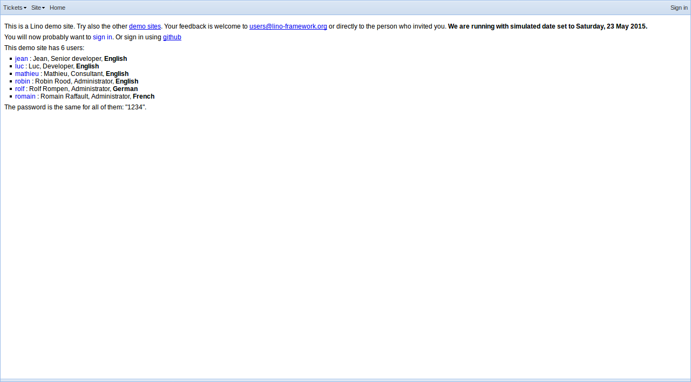

.. _team.tour:

==========================
A tour of the team project
==========================

A series of screenshots to show :ref:`noi` using the
:mod:`lino_book.projects.noi1e` demo project.

-----------------
Before signing in
-----------------

As long as you didn't authenticate, you are treated as an
anonymous user.

Da es sich um eine Demo-Datenbank handelt, stehen hier
alle Benutzer sowie deren Passwörter gezeigt, damit Sie die
Unterschiede ausprobieren können.  Beachten Sie, dass *Sprache*
und *Benutzerprofil* variieren.

.. _team.tour.oops:

------------
Not finished
------------

Oops, we had a problem when generating this document::

    Traceback (most recent call last):
      File "/media/dell1tb/work/lino/lino/api/selenium.py", line 199, in run
        func(self)
      File "docs/tours/team/maketour.py", line 48, in english_tour
        elem.send_keys("robin")
      File "/media/dell1tb/virtualenvs/py27/local/lib/python2.7/site-packages/selenium/webdriver/remote/webelement.py", line 479, in send_keys
        'value': keys_to_typing(value)})
      File "/media/dell1tb/virtualenvs/py27/local/lib/python2.7/site-packages/selenium/webdriver/remote/webelement.py", line 628, in _execute
        return self._parent.execute(command, params)
      File "/media/dell1tb/virtualenvs/py27/local/lib/python2.7/site-packages/selenium/webdriver/remote/webdriver.py", line 312, in execute
        self.error_handler.check_response(response)
      File "/media/dell1tb/virtualenvs/py27/local/lib/python2.7/site-packages/selenium/webdriver/remote/errorhandler.py", line 237, in check_response
        raise exception_class(message, screen, stacktrace)
    InvalidArgumentException: Message: Expected [object Undefined] undefined to be a string
    

