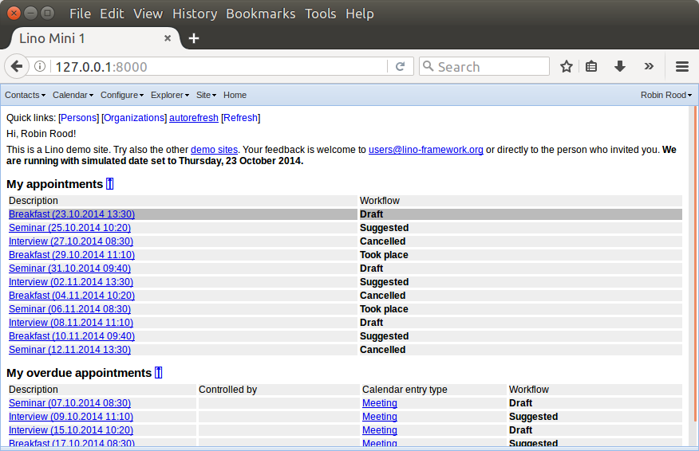

.. _lino.tutorial.hello:

===========================
Create a local Lino project
===========================

.. to test just this doc:

    $ doctest docs/tutorials/hello/index.rst

   doctest init::

    >>> from atelier.sheller import Sheller
    >>> shell = Sheller('docs/tutorials/hello')

In this tutorial we are going to create a local Lino project which
inherits from one of the simple :ref:`out-of-the-box projects
<lino.projects>` included with Lino.

We suppose that you have installed Lino itself as described in
:doc:`/dev/install`.

.. contents::
    :depth: 1
    :local:

       
Project directories
===================

A **project directory** is a directory which defines a runnable Django
project.  It contains the files necessary for that specific instance
of a given Lino application.

Until now (in :doc:`/dev/install`) you have been using some of the
project directories defined in the Lino Book, and you used them
directly from within the code repository.

Now we will create our first project directory of our own.

As a first step, create an empty directory::

    $ mkdir ~/projects

This is your **projects root**, which will hold all your Lino projects
on your computer.  Lino project directories are not very big, and you
will hopefully create many such projects and want to keep a backup of
them.

You can choose another name, just keep in mind that our examples are
based on this choice.

Now create an empty directory in your projects root which will become
your first *project directory*::

    $ mkdir ~/projects/hello

Got to that directory::
  
    $ cd ~/projects/hello

Create an empty file :xfile:`__init__.py` in this directory in order
to make it usable as a Python package::

    $ touch __init__.py

Create two other files :xfile:`settings.py` and :xfile:`manage.py` in
this directory as described hereafter.

The ``settings.py`` file
========================

Your first :xfile:`settings.py` file should look as follows:

.. literalinclude:: settings.py

Explanations:

#.  :mod:`lino_book.projects.min1` is one of the simple 
    :ref:`out-of-the-box projects
    <lino.projects>` included with Lino.

    We import these settings directly into our global namespace using
    the wildcard ``*``. This is necessary because that's how Django
    wants settings.
   
#.  Then comes the important trick which turns your Django project
    into a Lino application::

       SITE = Site(globals(), ...)

    That is, you *instantiate* a :class:`Site <lino.core.site.Site>`
    class and store this object as :setting:`SITE` in your Django
    settings. This line will automatically install default values for
    all required Django settings (e.g. :setting:`DATABASES` and
    :setting:`LOGGING`) into your global namespace.

You might add ``DEBUG = True`` or other settings of your choice
*after* these two lines, but it is not necessary here.

More about this in :doc:`/dev/settings`.
    

The ``manage.py`` file
=======================

Now add a :xfile:`manage.py` file with the following content:

.. literalinclude:: manage.py

A :xfile:`manage.py` must do at least two things: it must set the
:envvar:`DJANGO_SETTINGS_MODULE` environment variable and then call
Django's `execute_from_command_line` function.

This is plain traditional Django know-how.  There are many opinions,
tricks, flavors and conventions about Django's :xfile:`manage.py`
files, partly for historical reasons.  Lino does not add any tricks to
the :xfile:`manage.py` file, so you can use your own flavour if you
prefer.

Loading initial data into your database
=======================================

Next we create your database and populate it with some demo
content. With a Lino application this is easier than with a plain
Django project, it is just one command to type::

    $ python manage.py prep

That is, you run the :manage:`prep` management command that
comes with every Lino application.

It will ask you::

    INFO Started manage.py prep (using settings) --> PID 28463
    We are going to flush your database (.../default.db).
    Are you sure (y/n) ?

If you answer "y" here, then Lino will delete everything in the given
database and replace it with its "factory default" demo data.  Yes,
that's what we want. So go on and type ``y``.

The output that follows should look like this:

>>> shell("python manage.py prep --noinput")
... #doctest: +ELLIPSIS +REPORT_UDIFF
`initdb std demo demo2` started on database .../default.db.
Operations to perform:
  Synchronize unmigrated apps: about, bootstrap3, cal, contacts, countries, export_excel, extjs, gfks, jinja, lino_startup, office, printing, staticfiles, system, users, xl
  Apply all migrations: contenttypes, sessions
Synchronizing apps without migrations:
  Creating tables...
    Creating table system_siteconfig
    Creating table users_user
    Creating table users_authority
    Creating table countries_country
    Creating table countries_place
    Creating table contacts_partner
    Creating table contacts_person
    Creating table contacts_companytype
    Creating table contacts_company
    Creating table contacts_roletype
    Creating table contacts_role
    Creating table gfks_helptext
    Creating table cal_remotecalendar
    Creating table cal_room
    Creating table cal_priority
    Creating table cal_eventtype
    Creating table cal_guestrole
    Creating table cal_calendar
    Creating table cal_subscription
    Creating table cal_task
    Creating table cal_eventpolicy
    Creating table cal_recurrentevent
    Creating table cal_event
    Creating table cal_guest
    Running deferred SQL...
Running migrations:
  Applying contenttypes.0001_initial... OK
  Applying contenttypes.0002_remove_content_type_name... OK
  Applying sessions.0001_initial... OK
Loading data from ...
Installed ... object(s) from ... fixture(s)

Lino applications use to make abundant use of what we call *Python
fixtures* in order to have a rich set of "demo data".  We will come
back to this in :doc:`/dev/initdb`.

Start the web server
====================

Now you can start the development server::

  $ python manage.py runserver
  
which should output something like::  
  
  Validating models...
  0 errors found
  Django version 1.4.5, using settings 'hello.settings'
  Development server is running at http://127.0.0.1:8000/
  Quit the server with CTRL-BREAK.

And then point your web browser to http://127.0.0.1:8000 and you
should see something like this:

           
Congratulations! Enjoy the first Lino application running on your
machine!

Exercises
=========

- Log in and play around.
- Note that this site offers three languages.
- Note the main welcome screen (dashboard) and the main menu.
- Create some persons and organizations. But don't waste much time
  here with entering lots of accurate data because we are going to
  throw it away soon.

At this point **please arrange a voice session with your mentor**
because there is a lot of undocumented things to show here.

- the :attr:`is_demo_site <lino.core.site.Site.is_demo_site>`
  attribute

- try :mod:`lino_book.projects.chatter`
  

Visualizing database content from the command-line
==================================================

You can visualize the content of your database from the command-line
without starting a web server using Lino's :manage:`show` command. 
For example to see the list of users, you can write::

    $ python manage.py show users.Users

The output should be as follows:

>>> shell("python manage.py show users.Users")
... #doctest: +ELLIPSIS
========== =============== ============ ===========
 Username   User type       First name   Last name
---------- --------------- ------------ -----------
 robin      Administrator   Robin        Rood
========== =============== ============ ===========

Or you can see the list of countries:

>>> shell("python manage.py show countries.Countries")
... #doctest: +ELLIPSIS
============================= ==========
 Designation                   ISO code
----------------------------- ----------
 Belgium                       BE
 Congo (Democratic Republic)   CD
 Estonia                       EE
 France                        FR
 Germany                       DE
 Maroc                         MA
 Netherlands                   NL
 Russia                        RU
============================= ==========

