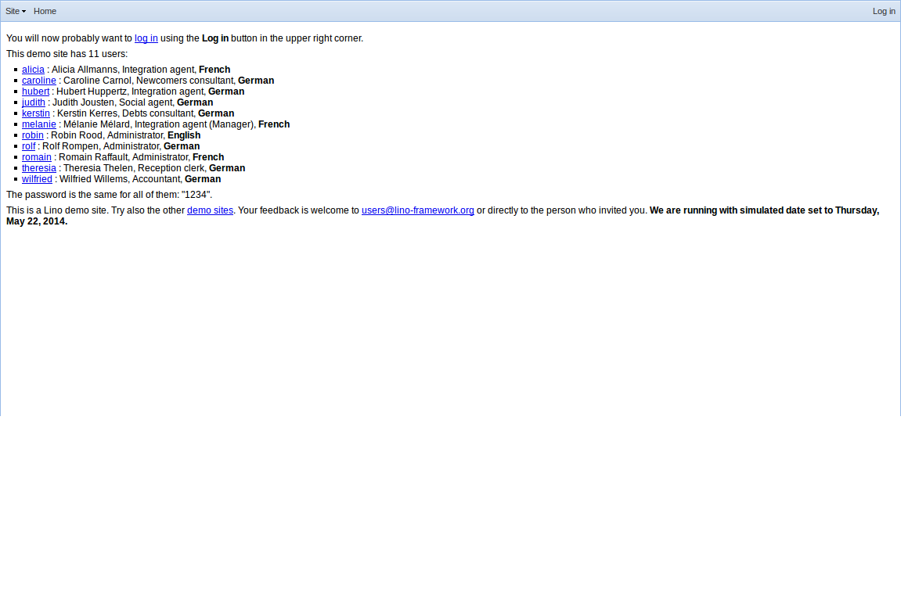
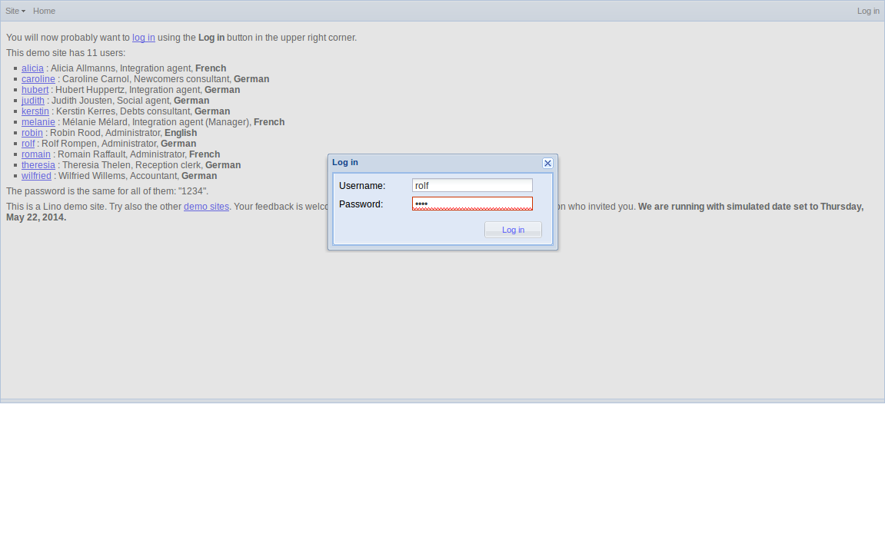
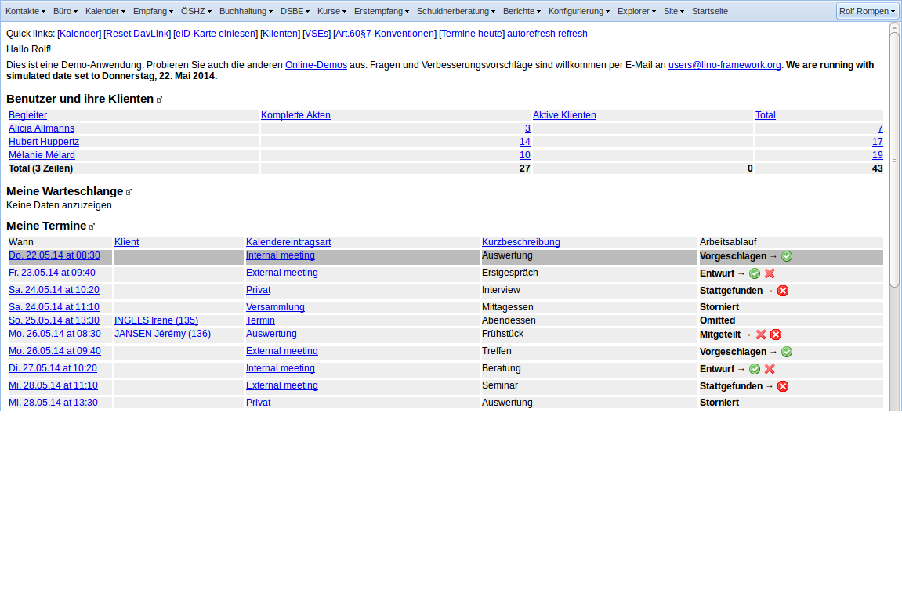
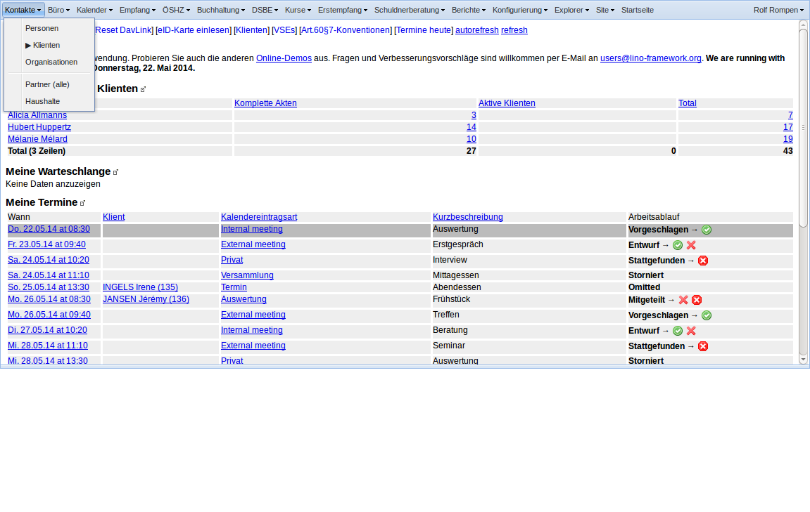
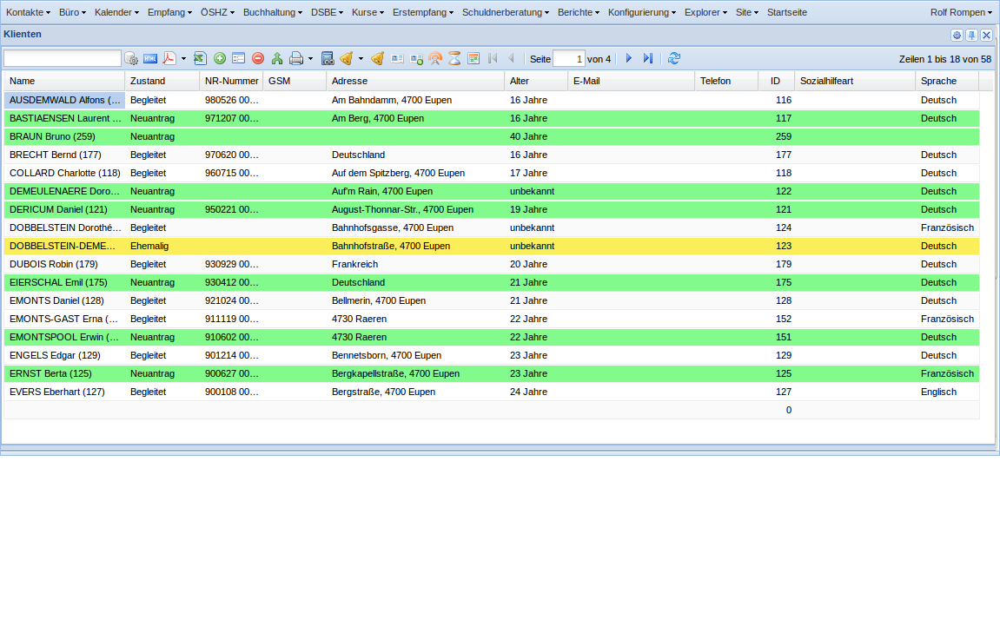
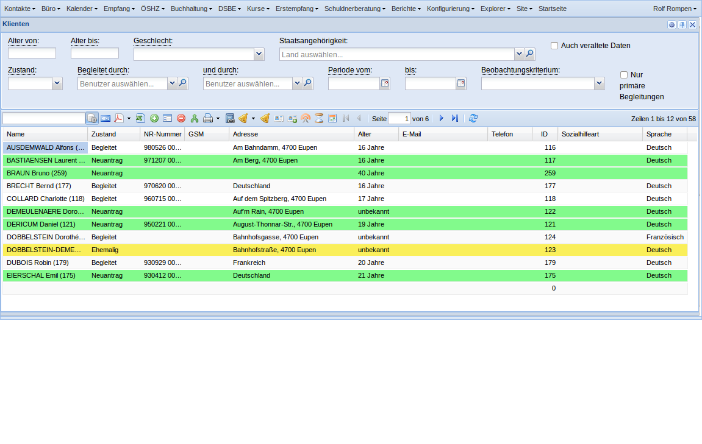
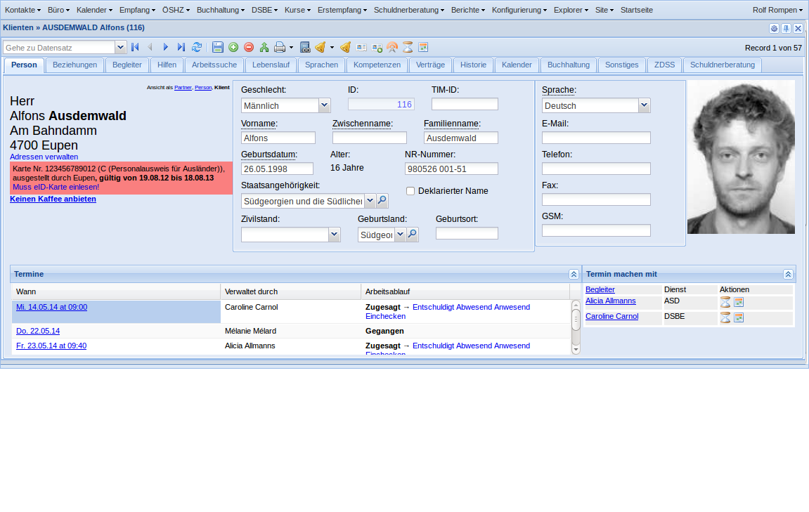

.. _welfare.de.tour:

=========
Lino-Tour
=========

Eine Serie von Bildschirmansichten um zu zeigen, wie Lino
Welfare aussieht.

Sie können die hier beschriebenen Aktionen auch selber
nachspielen in unserer `Online-Demo
<http://welfare-demo.lino-framework.org>`_

-----------------
Vor der Anmeldung
-----------------

Solange Sie sich nicht angemeldet haben, sind Sie ein anonymer
Benutzer.  Lino spricht deshalb im folgenden Bildschirm noch
Englisch (oder genauer gesagt die Sprache, die Sie in Ihrem
Browser als bevorzugt eingestellt haben).

Da es sich um eine Demo-Datenbank handelt, stehen hier
alle Benutzer sowie deren Passwörter gezeigt, damit Sie die
Unterschiede ausprobieren können.  Beachten Sie, dass *Sprache*
und *Benutzerprofil* variieren.

------------------
Das Anmeldefenster
------------------

Wir melden uns an mit Benutzernamen "rolf" und Passwort "1234".

-------------------
Der Startbildschirm
-------------------

Das ist der Startbildschirm. Hier haben wir eine Serie von Elementen:

- Das Hauptmenü
- Quicklinks
- Begrüßungsmeldungen
- Diverse Tabellen

----------------------------------
Das Menü :menuselection:`Kontakte`
----------------------------------

------------------
Liste der Klienten
------------------

Wählen Sie :menuselection:`Kontakte --> Klienten`, um die Liste
aller Klienten zu zeigen.

---------------
Filterparameter
---------------

    

-------------
Detail Klient
-------------

Doppelklick auf eine Zeile, um das Detail dieses Klienten zu zeigen.

